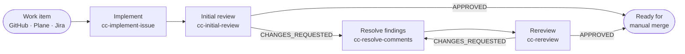

<div align="center">

# Code Cycle Toolkit

**Take a work item from the issue tracker to a reviewed, verified pull request that is ready for a human to merge.**

[](https://github.com/datacas/code-cycle-toolkit/actions/workflows/validate.yml)
[](CHANGELOG.md)
[](LICENSE)


[Start here](#start-here) · [Quick start](#quick-start) · [Workflows](docs/workflows.md) · [Skills](docs/skills.md) · [Configuration](docs/configuration.md) · [Documentation index](docs/README.md)

</div>

---

Coding agents can write a change. Getting that change **reviewed, fixed, re-reviewed and proven to work** — with a record anyone can audit later — is the part that usually stays manual and inconsistent.

Code Cycle Toolkit (`cc` = **Code Cycle**) is a set of portable Agent Skills plus an optional Python runtime. The skills tell Claude Code, Codex, or OpenCode how to run each stage of that cycle the same way every time. The runtime routes stages to models and records what happened.



The toolkit stops at `READY_FOR_MANUAL_MERGE`. **It never merges.**

## What it is built on

| Principle | What it means in practice |
|---|---|
| **Issue provider ≠ code host** | Work items come from GitHub Issues, Plane, or Jira. Code and review live on GitHub or Bitbucket. Any pair works. → [Providers](docs/provider-contract.md) |
| **Host-portable** | The same `skills/` run in Claude Code, Codex, and OpenCode, on Linux, macOS, Windows, and WSL. |
| **Manual merge boundary** | No skill merges, force-pushes, or deletes remote refs. A person owns the merge. |
| **Stable findings** | Every review finding gets a `REV-xxx` ID with a machine-readable header that survives across review rounds. → [Review lifecycle](docs/review-cycle.md) |
| **Evidence over claims** | A fix counts as verified only after it has been run. Skipped checks and unverified items are reported as such. → [Verification](docs/verification.md) |
| **Your conventions win** | `AGENTS.md`, `CLAUDE.md`, and `CONTRIBUTING.md` are read when present and override the defaults. None of them is required. |
| **Measured, not guessed** | The optional runtime records every stage in local telemetry, and `cc-stats` reports it. → [Telemetry](docs/telemetry.md) |

## Start here

Pick the row that matches what you want to do.

| I want to… | Use | Changes code? |
|---|---|:---:|
| implement an issue and open a pull request | [`cc-implement-issue`](docs/skills.md#cc-implement-issue) | ✅ |
| review an existing pull request | [`cc-initial-review`](docs/skills.md#cc-initial-review) | — |
| fix the findings a review left | [`cc-resolve-comments`](docs/skills.md#cc-resolve-comments) | ✅ |
| re-review a pull request after new commits | [`cc-rereview`](docs/skills.md#cc-rereview) | — |
| run the whole cycle from one prompt | [`cc-orchestrator`](docs/skills.md#cc-orchestrator) | via its stages |
| run the whole cycle as supervised Orca workers | [`cc-orca-orchestrator`](docs/skills.md#cc-orca-orchestrator) | via its stages |
| have Claude implement and Codex review | [`cc-orchestrator` in `claude_codex` mode](docs/workflows.md#claude--codex-mode) | via its stages |
| run a recorded cycle from the command line | [`run_cycle.py`](docs/workflows.md#runtime-driver-run_cyclepy) | via its stages |
| review a diff or branch without a pull request | [`cc-code-review`](docs/skills.md#cc-code-review) | — |
| audit a change for security | [`cc-security-review`](docs/skills.md#cc-security-review) | — |
| prove a change actually works | [`cc-verify`](docs/skills.md#cc-verify) | — |
| bring an unfamiliar project up locally | [`cc-run`](docs/skills.md#cc-run) | — |
| check that provider access is configured | [`cc-provider-bootstrap`](docs/skills.md#cc-provider-bootstrap) | — |
| see how the cycle has been performing | [`cc-stats`](docs/skills.md#cc-stats) | — |

Not sure? Read [Choosing a workflow](docs/workflows.md#choosing-a-workflow).

## Quick start

> [!NOTE]
> This is the shortest path. [Getting started](docs/getting-started.md) covers each step in full, including Windows and repository-level installs.

**1. Requirements.** Git, Python 3, an agent host (Claude Code, Codex, or OpenCode), and authenticated tooling for your issue provider and code host. For GitHub, that is [`gh`](https://cli.github.com/):

```bash
gh auth status
```

**2. Install the skills and the runtime.** One command downloads the latest release and installs the skills for every host, plus the runtime (routing and telemetry). Run it again later to update:

```bash
curl -fsSL https://raw.githubusercontent.com/datacas/code-cycle-toolkit/main/scripts/get.sh | bash
```

```powershell
irm https://raw.githubusercontent.com/datacas/code-cycle-toolkit/main/scripts/get.ps1 | iex
```

`npx skills add datacas/code-cycle-toolkit --all --global --copy` installs the skills **without** the runtime, so `cc-stats` and recorded cycles won't work. See [what the runtime adds](docs/getting-started.md#skills-and-runtime) and [other install options](docs/getting-started.md#install).

**3. Optional configuration.** In the repository you want to work on, a `.code-cycle.yml` stores non-secret defaults. On the first run, `cc-provider-bootstrap` proposes this file, including `review.trusted_authors` set to your authenticated login, and writes it only if you confirm. You can skip this step, or write it yourself:

```yaml
code_cycle:
  issue_provider: github
  code_host: github
  repository:
    selector: owner/repository
    default_branch: main
  review:
    trusted_authors: [your-github-login]
```

**4. Run it.** Open your agent in that repository and ask:

```text
Use cc-orchestrator for issue 123. Stop at READY_FOR_MANUAL_MERGE.
```

**5. What happens.** The orchestrator checks provider access. It then implements the issue on a branch, runs the tests, and opens a pull request. It reviews that pull request and publishes one consolidated comment with `REV-xxx` findings. It fixes valid findings and re-reviews, up to 6 rounds. It stops when the reviewed head is approved, checks pass, and no blocking finding remains.

**6. What you get.** An open pull request with a review trail in its comments, and a final status:

| Status | Meaning | Your next step |
|---|---|---|
| `READY_FOR_MANUAL_MERGE` | Approved at the current head, checks passed | Review and merge it yourself |
| `HUMAN_INTERVENTION` | Iteration limit hit, or no progress between rounds | Read the last review and decide |
| `BLOCKED` | Missing access, information, or an external condition | Fix what the summary names and rerun |
| `FAILED` | Unexpected technical failure | Read the reported cause |

## Ways to use it

| Mode | You drive… | Best for | Needs |
|---|---|---|---|
| [Single skills](docs/workflows.md#single-skills) | each stage by hand | one review, one fix, one audit | the skill |
| [Manual cycle](docs/workflows.md#manual-cycle) | the four cycle skills in order | full control between stages | the cycle skills |
| [`cc-orchestrator`](docs/workflows.md#cc-orchestrator) | one prompt | the whole cycle in the current agent | nothing extra |
| [Claude + Codex](docs/workflows.md#claude--codex-mode) | one prompt in Claude Code | Claude writes, Codex reviews | `codex-plugin-cc`, Codex |
| [`cc-orca-orchestrator`](docs/workflows.md#cc-orca-orchestrator) | one prompt | supervised workers, paired-review calibration | Orca |
| [`run_cycle.py`](docs/workflows.md#runtime-driver-run_cyclepy) | a shell command | recorded, routed cycles across executors | runtime, Codex and/or Claude CLIs |

## Skills

Thirteen skills in two layers. **Cycle skills** own the workflow: the change request, the finding IDs, the published comments, and the merge boundary. **Supporting skills** are focused passes that cycle skills delegate to. Each one also works on its own.

| Skill | Layer | Purpose | Changes code? |
|---|---|---|:---:|
| `cc-implement-issue` | cycle | Implement a work item, verify it, open a pull request | ✅ |
| `cc-initial-review` | cycle | Review the full pull-request diff, publish findings | — |
| `cc-resolve-comments` | cycle | Triage findings, fix valid ones, verify, push | ✅ |
| `cc-rereview` | cycle | Re-review the accumulated diff after changes | — |
| `cc-orchestrator` | cycle | Run the whole cycle, sequentially or with host delegation | via stages |
| `cc-orca-orchestrator` | cycle | Run the whole cycle through Orca Runs, Tasks, and Workers | via stages |
| `cc-pr-review` | supporting | Review criteria for a change request | — |
| `cc-code-review` | supporting | Review criteria for a diff, without the PR framing | — |
| `cc-security-review` | supporting | Security audit scoped to the change | — |
| `cc-verify` | supporting | Execution-backed verification | — |
| `cc-run` | supporting | Start a project's services and confirm they respond | — |
| `cc-provider-bootstrap` | supporting | Resolve and health-check the provider pair | — |
| `cc-stats` | supporting | Report local telemetry for this repository | — |

→ Inputs, statuses, and examples for each: [Skills reference](docs/skills.md)

## Everything you can configure

Configuration is optional. Invocation parameters override `.code-cycle.yml`, which overrides what can be inferred safely.

| Area | Where | Reference |
|---|---|---|
| Issue provider, code host, work-item scope | `issue_provider`, `code_host`, `issue.*` | [Configuration → Providers](docs/configuration.md#providers-and-repository) |
| Repository selector and default branch | `repository.selector`, `repository.default_branch` | [Configuration → Providers](docs/configuration.md#providers-and-repository) |
| Provider health-check cache | `verification.cache_ttl` | [Configuration → Provider health](docs/configuration.md#provider-health-cache) |
| Models, executors, effort, fallbacks | `profiles.<profile>.primary` / `.fallback` | [Routing → Profiles](docs/routing.md#profiles) |
| Routing strategy | `routing.strategy` (`fixed` \| `measured`) | [Routing → Strategies](docs/routing.md#routing-strategies) |
| Jev shadow suggestions | `routing.jev.*`, `TYPESAFE_API_KEY` | [Routing → Jev](docs/routing.md#jev-shadow-mode) |
| Who can advance findings | `review.trusted_authors` | [Review lifecycle → Trust](docs/review-cycle.md#trusted-authors) |
| When the security audit always runs | `security_review.always_when.*` | [Configuration → Security](docs/configuration.md#security-review-rule) |
| Orchestration mode | `orchestration.mode`, `orchestration_mode=` | [Workflows → cc-orchestrator](docs/workflows.md#cc-orchestrator) |
| Reviewer calibration candidates | `calibration.profiles.*` | [Routing → Calibration](docs/routing.md#calibration) |
| Output language | `lang=` in the prompt | [Configuration → Language](docs/configuration.md#output-language) |
| Iterations, agents, paired review | `max_iterations=`, `implementer=`, `reviewer=`, `paired_review=` | [Configuration → Invocation parameters](docs/configuration.md#invocation-parameters) |
| Telemetry location | `CODE_CYCLE_HOME` | [Configuration → Environment](docs/configuration.md#environment-variables) |
| Installer and CLI flags | `install.sh`, `run_cycle.py`, `stats.py` | [Configuration → Command-line flags](docs/configuration.md#command-line-flags) |

→ Full key-by-key reference with defaults: [Configuration](docs/configuration.md)

## What it does not do

- **Merge.** The final merge is always a human decision.
- **Replace your tools.** It isn't a tracker, CI service, code host, or deployment system, and it ships no API clients or credentials. It uses the `gh` CLI, connectors, or MCP servers you already authenticated.
- **Invent verification.** It runs the tests and checks your project defines. When it can't run something, it says so and why.
- **Treat silence as success.** Skipped, pending, or missing checks are reported as exactly that.
- **Pick models from statistics.** Routing follows declared rules. Telemetry records outcomes, and nothing adapts automatically. Jev only ever runs in shadow mode.
- **Bundle external components.** Orca (for `cc-orca-orchestrator`) and `codex-plugin-cc` (for Claude + Codex mode) are installed and authenticated separately. See the [adapter contract](skills/cc-orchestrator/references/codex-plugin-cc.md).
- **Enforce publication technically.** What each stage may publish is a rule in its prompt, not a sandbox. Use separate credentials when you need a hard guarantee. → [Routing → Publication](docs/routing.md#publication-boundary)

## Documentation

| Guide | Covers |
|---|---|
| [Getting started](docs/getting-started.md) | Requirements, installation, authentication, first run |
| [Workflows](docs/workflows.md) | Every way to run the toolkit, and when to choose each |
| [Skills reference](docs/skills.md) | All thirteen skills: inputs, outputs, statuses |
| [Review lifecycle](docs/review-cycle.md) | `REV-xxx` findings, severities, dispositions, run lines |
| [Verification](docs/verification.md) | Evidence rules, stop conditions, CI reporting |
| [Routing and models](docs/routing.md) | Profiles, executors, fallbacks, strategies, Jev, calibration |
| [Configuration](docs/configuration.md) | Every `.code-cycle.yml` key, parameter, flag, and variable |
| [Providers](docs/provider-contract.md) | Issue provider and code host contract |
| [Telemetry and `cc-stats`](docs/telemetry.md) | What is recorded, where, and how to read it |
| [Role workspace policy](docs/role-workspace-policy.md) | What each stage may write |
| [Instrumentation internals](docs/instrumentation.md) | Design reference for the record, routing, and telemetry |

## Contributing

Run the validator and tests before opening a pull request:

```bash
python3 scripts/validate-package.py
python3 -m unittest discover -s tests
```

See [CONTRIBUTING.md](CONTRIBUTING.md) for the skill-authoring rules, including how the duplicated sections are kept in sync. Security reports go through [SECURITY.md](SECURITY.md). Changes are recorded in [CHANGELOG.md](CHANGELOG.md). Released under the [MIT License](LICENSE).
