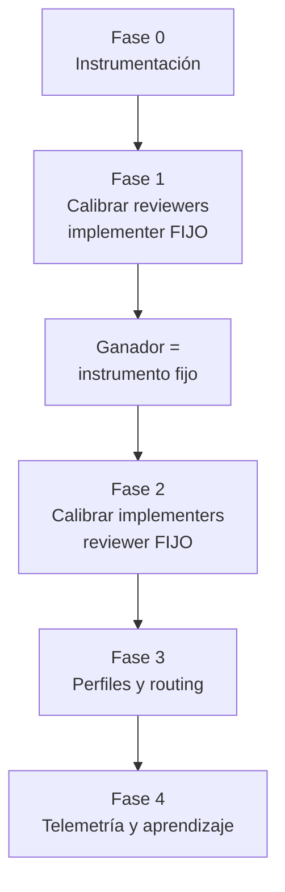
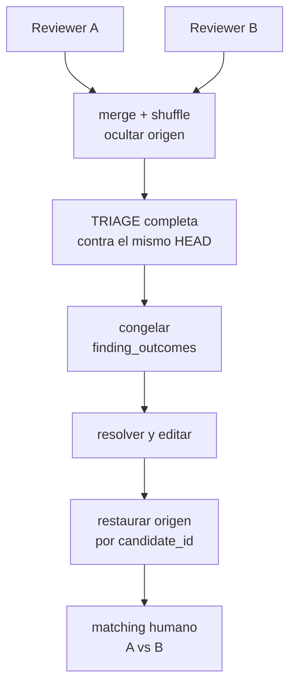

# Plan de instrumentación y routing — code-cycle-toolkit

2026-09-18 · @Someone

## Principio rector

La primera variable para decidir cuánto merece gastar en un modelo no es la dificultad de la tarea ni el precio por token: es el coste de detectar que ha fallado, o dicho de otro modo, **si el fallo se detecta solo**.

Cuando un test rojo, un build roto o un servicio que no responde avisan del error, detectarlo cuesta cero. Ahí el modelo barato es racional aunque acierte menos, porque reintentar es barato y el intento fallido no consume tu atención. Cuando el único detector eres tú leyendo un diff de catorce archivos, el coste dominante es tu tiempo, y ahorrar créditos en el modelo optimiza el sumando pequeño.

Es la primera variable, no la única: después entran la severidad del coste de fallo, el tamaño del contexto y la tasa empírica de acierto, que es justo lo que el router acabará usando como \`difficulty\` y \`security\_sensitive\`. Pero es la que ordena las demás, y de ella se derivan tres reglas:

1. **Primero haz verificable la tarea, después elige modelo.** Partir un encargo ambiguo en diseño escrito (que revisas leyendo, barato) más implementación contra tests (que revisa la máquina) vale más que cualquier elección de modelo. Anthropic ya lo tiene implementado como `/model opusplan`.
2. **Un wrapper barato nunca decide si se omite una comprobación cara.** Un coordinador puede secuenciar trabajo caro; no puede concluir por juicio semántico que ese trabajo no hace falta.
3. **Esto no se ajusta con benchmarks públicos.** Las tablas que circulan mezclan versiones incompatibles y costes mal calculados. La decisión se toma con tus PRs o no se toma.

El objetivo del plan no es elegir modelo hoy. Es construir el instrumento que permita elegirlo con datos tuyos dentro de unas semanas.

## El orden importa

Las dos calibraciones no pueden solaparse, y la de reviewers va primero.

Para comparar implementers hace falta un reviewer fijo: el reviewer es el instrumento de medida y no se cambia la regla mientras se mide. Un reviewer indulgente aprueba a la primera a cualquiera y todos los implementers salen al 95%; uno estricto los separa. Si varías ambos a la vez, las diferencias que observes entre Luna High y Terra pueden ser diferencias de reviewer.

Y la campaña pareada varía el reviewer a propósito. Mientras corre, los datos de implementer no valen.



La calibración de reviewers va antes aunque intuitivamente parezca al revés, porque su resultado es precisamente qué reviewer fijas como instrumento en la fase 2. Si haces la fase 2 primero con un reviewer elegido a ojo y luego descubres que era el ruidoso, tiras esos datos.

El gate de seguridad determinista es independiente de las dos y puede entrar en cualquier momento; cuanto antes, mejor, porque no depende de ningún dato.

## Fase 0 — Instrumentación

Son dos campos JSON y un cambio de orden. Es lo único que bloquea todo lo demás y cabe en una tarde.

### 0.1 La disposición va en la cabecera del finding

El bloque `ORCHESTRATION_RESULT` está **off por defecto** en las tres skills del ciclo, así que no se puede asumir que cada ejecución deje un JSON. El repo ya resuelve ese problema: precisamente porque el bloque es opcional, declara que el comentario publicado es el registro máquina-legible, y define un contrato de cabecera con cuatro tokens neutros al idioma.

Hoy:

```text
#### [REV-004] · medium · open · blocks:yes — Short title
```

Con la disposición como quinto token:

```text
#### [REV-004] · medium · resolved · valid · blocks:yes — Short title
```

Enum: `valid | debatable | incorrect | obsolete | needs_clarification | -`. El guión es necesario porque el reviewer publica findings que todavía nadie ha triado; solo el resolver asigna disposición.

**Compatibilidad.** Los PRs vivos tienen cabeceras de cuatro tokens y el siguiente run parsea esa línea para recuperar estado. El parser acepta las dos formas: **cuatro tokens = legacy, disposición ausente**, equivalente a `-`. Sin esa regla, un ciclo a medias devuelve `BLOCKED` por una migración de formato.

**La disposición es inmutable.** La asigna el primer resolver que tria el finding, y a partir de ahí se preserva verbatim: `cc-rereview` la republica tal cual, nunca la resetea a `-` ni la recalcula contra el HEAD nuevo. `status` sigue moviéndose (`open` → `resolved`); `disposition` no.

El motivo es de medición, no de implementación. Lo que queremos saber es si el hallazgo era un problema real cuando se escribió. Una segunda opinión emitida contra código ya corregido refleja sobre todo el arreglo, no la validez original. Así `resolver_acceptance_rate` queda sin ambigüedad: cuenta la primera disposición, atada al `review_run_id` que parió el `REV`. Si alguna vez el resolver concluye que se equivocó, eso sale en la auditoría manual, no sobrescribiendo el dato.

`status` y `disposition` son ortogonales y ambos hacen falta: uno dice qué pasó con el código (`open|resolved|not_applicable`), el otro qué opinó el resolver del hallazgo.

Esto es mejor que serializarlo en el JSON por cuatro motivos: se escribe siempre, sin depender de que alguien recuerde `--orchestration-result`; el siguiente run ya parsea esa línea para recuperar estado, así que es carga viva y no se degrada sin que nadie lo note; se puede extraer retroactivamente de PRs ya cerrados; y no obliga a forzar un modo de ejecución durante las campañas.

`finding_outcomes` en el bloque pasa a ser un **espejo** para el orchestrator, no la fuente de verdad:

```json
"finding_outcomes": [
  { "id": "REV-001", "disposition": "valid",     "status": "resolved" },
  { "id": "REV-002", "disposition": "incorrect", "status": "not_applicable" }
]
```

**Restricción de implementación.** `### The change-request comment is the machine-readable record` es una de las tres `SHARED_REVIEW_SECTIONS` que `scripts/validate-package.py` exige byte-idénticas entre `cc-initial-review`, `cc-rereview` y `cc-resolve-comments`. El cambio se aplica igual en las tres o CI lo para, y toca revisar `tests/test_validate_package.py`. Esa rigidez juega a favor: el validador garantiza que el contrato no derive entre skills.

### 0.2 Congelar antes de editar

El Triage actual de `cc-resolve-comments` es secuencial por comentario: el paso 4 clasifica, el 5 responde y el 6 implementa, uno a uno. Pasa a ser: clasificar **todos** los findings contra el mismo HEAD, escribir sus cabeceras con la disposición, y solo entonces responder, consolidar duplicados e implementar.

Sin esto, arreglar el finding A convierte al B equivalente en `obsolete` artificialmente, y quién se lleva el `obsolete` lo decide el orden de la lista — ruido aleatorio inyectado justo en la métrica que quieres limpia.

### 0.3 Identidad del reviewer donde nacen los REV

La clave del join es el `REV-xxx`, y nace en la review, no en el commit de arreglo. Hoy ni `cc-initial-review` ni `cc-rereview` llevan `review_run_id` ni bloque `reviewer`. Como la cabecera de finding es por hallazgo, la identidad va en una línea de cabecera de run en el mismo comentario publicado, con el mismo criterio de tokens neutros al idioma, y por tanto también a sección compartida con la misma disciplina de byte-idéntico:

```text
CCR-20260918-001 · senior_reviewer · anthropic/sonnet-5→sonnet-5 · high · schema:1
```

El texto compartido tiene que estar redactado **neutro al rol**, porque `cc-resolve-comments` no es un reviewer y nunca emite esa línea. La regla se escribe sobre la línea, no sobre quién la escribe: la emite la skill que abre un review run, y cualquier skill que republique el comentario la preserva verbatim. Así el mismo párrafo vale byte-idéntico en las tres.

Espejo en el bloque cuando esté habilitado:

```json
"review_run_id": "CCR-20260918-001",
"reviewer": {
  "profile":  "senior_reviewer",
  "provider": "anthropic",
  "model":    "sonnet-5",
  "effort":   "high"
},
"findings": [ { "id": "REV-001" }, { "id": "REV-002" } ]
```

El `review_run_id` es necesario porque un mismo PR tiene una initial review y varias rereviews. Registra modelo y effort aunque los tengas fijos: los modelos se actualizan por detrás sin avisar, y si dentro de dos meses las tasas se mueven sin haber tocado nada, ese campo distingue "cambió el implementer" de "cambió el instrumento".

### 0.4 Perfiles mínimos y dispatch

La fase 1 necesita lanzar dos reviewers con modelos distintos, así que una versión mínima de perfiles tiene que existir antes. No es el router de la fase 3: bastan dos alias y el mecanismo de despacho.

```yaml
profiles:
  reviewer_a: claude/sonnet-5-high
  reviewer_b: openai/terra-high
```

El mecanismo básico de delegación ya existe en `cc-orca-orchestrator`, pero la Fase 1 requiere una pequeña extensión para despachar dos reviewers independientes sobre el mismo HEAD y recoger ambos resultados antes de continuar. La generalización a siete perfiles y adapters llega en la fase 3, cuando las calibraciones hayan confirmado que el routing aporta.

### 0.5 Metadata de cada run

Un `schema_version` en todos los artefactos desde el primer día. `finding_outcomes`, los perfiles y los campos de consumo van a cambiar, y dentro de seis meses no querrás adivinar qué formato tenía cada run.

```text
en la línea de run (siempre):
  review_run_id · profile · provider/model_requested→model_resolved · effort · schema

en el espejo JSON (opcional):
  toolkit_version · skill_version/hash · executor · cli_version
```

El reparto no es arbitrario. `model_requested` frente a `model_resolved` es el detector de deriva que las trampas declaran obligatorio, así que va en la línea que se escribe siempre: si `sonnet` o `luna` mantienen el alias mientras cambia el backend, el nombre por sí solo no explica un movimiento en las tasas.

El modelo resuelto depende de que el host lo exponga, y ni Codex ni Claude Code garantizan devolverlo. La regla es degradar, nunca romper el formato: cuando no haya valor, el token se escribe `sonnet-5→?`. Un interrogante dice "no se pudo saber", que es información distinta de "no cambió", y mantiene la línea parseable con la misma forma siempre.

El par se escribe **siempre**, también cuando coinciden (`anthropic/sonnet-5→sonnet-5`). Un formato de forma constante es más fácil de parsear que uno con flecha opcional, y convierte "no hubo deriva" en una afirmación observable en vez de una ausencia, que es el mismo criterio que la degradación a `?`.

`toolkit_version` y el hash de skill pueden quedarse en el espejo opcional porque la regla de congelación de la fase 1 los fija durante toda la campaña: si no cambian, basta anotarlos una vez al abrirla en vez de repetirlos en cada run. Fuera de campaña ese registro es opt-in, y es un precio aceptable.

### Salida de la fase

Cada ciclo deja, en el comentario publicado y sin depender de ningún flag, quién revisó, qué encontró y qué opinó el resolver de cada hallazgo. A partir de ahí todo lo demás es análisis, y se puede hacer sobre PRs que ya estén cerrados.

## Fase 1 — Calibrar reviewers

Campaña temporal de 15–20 PRs con doble review ciega. Termina; no es permanente.

**Implementer fijo** durante toda la fase (`cheap_coder` = Luna High). Si varía, los diffs que revisan A y B difieren en calidad por dos motivos a la vez y el pareado deja de serlo.

**Selección pseudoaleatoria**, nunca manual: `hash(task_id) % 5 == 0`. Si eliges tú qué PRs parear, acabarás pareando los difíciles y reintroduces el confounding que la fase intenta evitar.

**Los dos reviewers no se ven.** Mismo base SHA, head SHA, issue y contexto; findings independientes. El challenger trabaja con `candidate_id` opacos (`CAL-001`) para no competir por el espacio de IDs públicos.

**Configuración congelada durante toda la fase**, no solo los modelos: reglas de seguridad, versión del toolkit, y prompt o versión de cada skill. Si modificas `cc-pr-review` a mitad de los 15 PRs has cambiado el instrumento aunque el modelo sea el mismo, y los datos de antes y después dejan de ser comparables.

Si durante la campaña aparece algo que obliga a tocar una skill — un bug que te bloquea — no lo arregles en silencio: anótalo, sube `schema_version`, y trata los PRs anteriores y posteriores como estratos distintos, o reinicia la campaña. Una regla de congelación sin procedimiento de emergencia es una regla que se incumple sin dejar rastro.

### Protocolo



Fundir las dos listas antes del triage resuelve tres problemas a la vez: el challenger obtiene disposiciones (si no se publica, nunca pasa por el resolver y te quedas sin su tasa), el resolver clasifica sin saber quién escribió cada hallazgo, y los duplicados llegan juntos, lo que abarata el matching.

### Métricas

| Métrica | Fórmula | Qué mide |
| --- | --- | --- |
| `resolver_acceptance_rate` | valid / (valid + incorrect + debatable) | Opinión del resolver, no verdad objetiva |
| `unique_valid` | hallazgos exclusivos de A o B **y** `valid` | Cobertura real añadida |
| `shared_valid` | mismo root cause según matching humano, válido para ambos | Solape |
| `obsolete_rate` | obsolete / total | Latencia del ciclo, **no** calidad del reviewer |
| `needs_clarification_rate` | needs\_clarification / total | Claridad de los findings |

`unique` a secas premiaría al reviewer más ruidoso: un hallazgo exclusivo solo cuenta si vuelve como `valid`.

### El matching lo haces tú

Decidir si "authorization is checked only in middleware" y "direct handler invocation bypasses role verification" son el mismo bug es exactamente el juicio que no verifica nadie. Automátizalo y habrás reintroducido el portero no verificado dentro del instrumento de medida.

Eso pone el techo de la campaña: es trabajo tuyo por PR pareado. Por eso 15–20 y con final, no un 20% permanente.

### Dónde vive la atribución

Dos review runs confluyen en un comentario fusionado, así que una sola línea de cabecera de run no los cubre — y el protocolo oculta el origen a propósito hasta después del triage. Durante la campaña, el mapa `REV → reviewer` vive fuera del comentario, y es el único dato de la fase 1 que no se puede reconstruir después. Tiene que estar dicho explícitamente, no quedar implícito.

Dos sitios con funciones distintas, no dos alternativas:

1. **Durante la campaña**, un fichero de campaña fuera del repo con `candidate_id → review_run_id`. Es el almacén de trabajo, y existe para que la atribución sobreviva si la campaña se interrumpe a medias.
2. **Al cerrar cada PR pareado**, un bloque de atribución publicado en el propio comentario: las dos líneas de run y qué `REV` pertenece a cada una. Ese es el registro durable, y mantiene la promesa de la fase 4 de que todo el análisis sale de un solo canal.

El orden importa y no es negociable:

```text
triage a ciegas  →  congelar disposiciones  →  matching humano a ciegas
                                                        ↓
                                          publicar bloque de atribución
```

La atribución se publica **después del matching**, no antes. Emparejar root causes sabiendo quién escribió cada hallazgo sesga menos que juzgar validez, pero sesga; y como las disposiciones ya están congeladas, publicarla al final no contamina nada.

Ese bloque es un artefacto de calibración, no contrato permanente: **no va a las `SHARED_REVIEW_SECTIONS`**. Meter la maquinaria de la campaña en el contrato compartido de las skills es exactamente lo que no queremos, porque la campaña termina y el contrato se queda.

## Fase 2 — Calibrar implementers

Reviewer fijo, implementer variable. El reviewer es ahora el instrumento y no se toca.

**Cuál fijar:** el ganador de la Fase 1, y uno que vayas a mantener meses, porque todos los números de implementer quedan referidos a él y cambiarlo después invalida el histórico.

**Hipótesis de partida:** `senior_reviewer = Sonnet High` es uno de los candidatos principales para la Fase 1, por consumo de cuota y posicionamiento como modelo general de coding review. **No se fija como instrumento hasta que la calibración lo confirme frente a Terra High.** Opus queda para escalado puntual, no como instrumento inicial.

**Qué se varía:** Luna High, Luna Max y Terra Medium/High, asignados al azar dentro de cada estrato. Etiqueta `difficulty` (1-3) y `verifiability` (auto / partial / human) **antes** de elegir modelo; si eliges según tu juicio y luego mides, mides tu enrutado, no los modelos.

**Qué se mide:** el ciclo mismo es la señal.

| Resultado del ciclo | Lectura |
| --- | --- |
| `initial-review` APPROVED | implementación limpia |
| 1 resolve + rereview | buena |
| 2 iteraciones | regular |
| 3+ iteraciones | mala |

Ponderado por severidad: "falta un test" y "fallo de autorización" no valen igual, y el campo `severity` ya existe en el contrato de findings.

**El límite de esta fase:** con decenas de tareas repartidas entre tres configuraciones detectas efectos grandes ("Terra desatasca cosas donde Luna se estrella"), nunca la diferencia entre un 91% y un 93%. Trata cualquier diferencia menor de diez puntos como ruido.

## Fase 3 — Perfiles, executors y routing v1

Las skills nunca nombran un modelo. Nombran un perfil.

```yaml
profiles:
  cheap_tool:
    primary:  claude/haiku-4.5
    fallback: openai/luna-medium
  auxiliary_tool:
    primary:  openai/luna-medium
  coordinator:
    primary:  openai/luna-medium
  cheap_coder:
    primary:  openai/luna-high
  deep_coder:
    primary:  openai/luna-max
  reviewer:
    primary:  openai/terra-high
  senior_reviewer:
    primary:  claude/sonnet-5-high
    fallback: claude/opus-5-high
  security:
    primary:     openai/sol-high
    independent: claude/opus-5-high
```

`auxiliary_tool` es el perfil que usan las skills auxiliares integradas. El
perfil `cheap_tool` se conserva por compatibilidad con configuraciones y
llamadas directas existentes; no es una asignación de las skills integradas.

Usa alias y resuelve contra lo que aparezca en `/model`, sin fijar identificadores de versión: el catálogo cambia solo.

### Asignación por skill

| Skill | Perfil | Quién juzga el resultado |
| --- | --- | --- |
| `cc-provider-bootstrap` | `auxiliary_tool` | health checks del provider |
| `cc-run` | `auxiliary_tool` | el servicio responde o no |
| `cc-verify` | `auxiliary_tool` | comandos ejecutados |
| `cc-orchestrator` | `coordinator` | secuenciación, se ve al momento |
| `cc-orca-orchestrator` | `coordinator` | ídem |
| `cc-initial-review` | `coordinator` | coordina; delega el criterio |
| `cc-rereview` | `coordinator` | coordina; delega el criterio |
| `cc-implement-issue` | `cheap_coder` → `deep_coder` | tests |
| `cc-resolve-comments` | `cheap_coder` → `deep_coder` | cada fix se verifica |
| `cc-code-review` | `reviewer` | nada, salvo tú |
| `cc-pr-review` | `senior_reviewer` | nada, salvo tú |
| `cc-security-review` | `security` | **nada, nunca** |

Los coordinadores van al perfil barato aunque secuencien trabajo caro. `cc-initial-review` declara en su propio SKILL.md que coordina y no redefine criterios de review: ponerlo en un perfil caro mientras delega a `cc-pr-review` es pagar dos veces.

### Executors

Cada stage puede ir a un stack distinto, y ahí está el beneficio de las dos cuotas: el implementer consume Codex mientras el reviewer consume Claude, en paralelo y con familias distintas, lo que además descorrelaciona los fallos.

Esto ya existe hoy sin construir nada:

```text
Use cc-orca-orchestrator for issue 123 in owner/repo with
implementer=codex reviewer=claude max_iterations=6.
```

El `orchestration_mode=claude_codex` documentado en el README hace lo contrario — Claude implementa y Codex revisa — que pone el stack caro en el trabajo que los tests ya validan. Invírtelo.

Los alias mínimos \`reviewer\_a\` y \`reviewer\_b\` ya existen desde la fase 0; lo que llega aquí es la generalización a los siete perfiles y la abstracción genérica de executor (adapters Claude→Codex, Codex→Claude, Orca), que es la construcción grande de esta fase. Merece la pena cuando las fases 1 y 2 hayan confirmado que el routing aporta; antes es infraestructura para una hipótesis sin probar.

### `single_agent`

Queda como fallback de compatibilidad, nunca como modo recomendado. Con un solo modelo haciendo todo el ciclo, cada `cc-verify` y cada edición mecánica se pagan a la tarifa del modelo más caro del ciclo. La respuesta correcta cuando no hay routing no es subir de modelo: es no usar el ciclo completo en `single_agent`.

## Fase 4 — Telemetría, aprendizaje y benchmark privado

Esta fase llega cuando ya hay volumen. Como el bloque `ORCHESTRATION_RESULT` está off por defecto, la ruta de análisis de las fases 1 y 2 no es un directorio de JSONs: es `gh api` sobre los comentarios publicados, parseando las cabeceras de finding y de run. SQLite es la respuesta correcta a los 500 runs, no a los 20, y un esquema diseñado antes de conocer las preguntas es un esquema que vas a migrar.

Los PRs de la campaña pareada llevan además el bloque de atribución descrito en la fase 1, así que el parser tiene que contemplar dos líneas de run en un mismo comentario y el mapa `REV → run` que las acompaña.

### SQLite por repositorio

Fuera del repo, en `~/.config/code-cycle-toolkit/telemetry.sqlite`. Una fila por ejecución con: `repo_id`, `task_id`, `skill`, `difficulty`, `verifiability`, `profile`, `model`, `effort`, `review_run_id`, `first_review_status`, `iterations`, `findings`, `finding_outcomes`, `final_status`, consumo. Nada de esto entra en Git.

### Aprendizaje por repositorio

La hipótesis es que tus repositorios tienen perfiles distintos, y es plausible: código, convenciones y cobertura de tests difieren entre ellos. Pero partir los datos por repo divide una muestra ya pequeña, así que solo podrá detectar efectos grandes — "este modelo se atasca aquí" — nunca ordenar candidatos separados por dos o tres puntos. Trata la tabla por repo como detector de problemas, no como ranking.

### Recall: los defectos que se escapan

La precisión se mide sola en cuanto existe `finding_outcomes`. El recall no: si el reviewer no encontró el bug, no hay ningún `REV` que analizar. Hace falta asociación retrospectiva, y es barata si se monta desde el principio:

```text
Code-Cycle-Task: CC-2026-0042
Reviewer-Profile: senior_reviewer
Reviewer-Model: sonnet-5
```

Cuando aparezca un bug semanas después: `git blame` → commit → `Code-Cycle-Task` → PR → reviewer que lo dejó pasar. Acumulado por perfil, eso es `escaped_defects`, el eje que completa a la precisión.

### Benchmark privado congelado

En paralelo, ir guardando 20–30 tareas reales interesantes con su diff, sus tests y su resultado conocido. Cuando salga un modelo nuevo, esa colección responde en una tarde si mejora lo que ya tienes — y responde sobre tu código, que es lo que ninguna tabla pública puede hacer. Mantenlo separado de la telemetría de producción: uno es histórico congelado, la otra es flujo vivo.

## Gate de seguridad determinista

Independiente de las fases; cámbialo cuando quieras, cuanto antes mejor.

Hoy `cc-initial-review` hace la sensitivity triage que decide si se lanza `cc-security-review`. Eso convierte al coordinador en portero de la comprobación más cara del ciclo, y un falso negativo ahí ocurre **antes** de que llegue ningún modelo bueno. Encarecer al portero no lo arregla: sigue siendo un juicio semántico sin verificador.

La regla es la unión de un disparo determinista y la opinión del modelo:

```yaml
security_review:
  always_when:
    paths:
      - "auth/**"
      - "middleware/**"
      - "migrations/**"
      - "routes/**"
    files:
      - "package-lock.json"
      - "requirements.txt"
      - "Dockerfile"
      - "*.env.example"
    labels: ["security", "auth", "data"]
```

```text
security_required = deterministic_rule OR reviewer_requests_security
```

El modelo puede **añadir** una revisión de seguridad, nunca quitar una que la regla haya activado. Un falso negativo exige entonces que fallen los dos a la vez, y la regla cuesta cero créditos. Con esto, `cc-initial-review` y `cc-rereview` pasan a ser coordinadores de verdad y su perfil barato deja de ser un riesgo.

La lista de paths es la tuya: revísala por repositorio y añade lo que toque límites de confianza en cada uno.

## Trampas conocidas

Cada una de estas invalida datos sin avisar. Merecen una relectura antes de empezar cada fase.

**Confounding por indicación.** Si asignas modelo según tu juicio de dificultad y luego mides resultados por modelo, mides tu enrutado. Etiqueta antes de elegir, asigna al azar dentro del estrato.

**Calibrar los dos extremos de la regla a la vez.** Reviewer e implementer no se varían en la misma fase. Es el motivo de que las fases 1 y 2 sean secuenciales.

**Quién puntúa al puntuador.** `cc-resolve-comments` corre en `cheap_coder` y es quien decide si el reviewer tenía razón: un modelo barato calificando hallazgos de uno caro. Si no entiende un finding sutil, lo marcará `incorrect` y penalizará sistemáticamente al mejor reviewer. Por eso la métrica se llama `resolver_acceptance_rate` y no `precision`: mide la opinión del resolver, no la verdad.

**Auditoría no ciega.** Al revisar a mano los `incorrect` y `debatable`, quita antes `provider`, `model`, `profile`, `effort` y cualquier `review_run_id` identificable. Auditar sabiendo quién escribió el finding confirma lo que ya esperabas. Es un `jq` que borra campos y es la diferencia entre una auditoría y un ritual.

**`obsolete` castigando al lento.** Un reviewer más concienzudo tarda más y produce más findings obsoletos solo por eso. Fuera de la tasa de cabecera, siempre.

**Duplicados en la lista fusionada.** Con catorce findings donde normalmente hay ocho, el resolver puede marcar como redundante el segundo de un par aunque nadie haya tocado el código. Congelar no lo evita; el shuffle lo reparte al azar y el matching manual te lo pone delante, así que lo detectarás al calibrar.

**Tamaño de muestra.** Con 15–20 PRs pareados y unas decenas de tareas por brazo, el instrumento detecta efectos grandes. Cualquier diferencia de pocos puntos es ruido, y partirla por repositorio la vuelve más ruidosa todavía.

**Deriva del instrumento.** Un alias que no cambia mientras cambia el backend, o una skill retocada a mitad de campaña, mueven los resultados sin que nada en los datos lo explique. Por eso `model_requested` frente a `model_resolved`, el hash de la skill y `schema_version` van en cada run desde el primer día: son baratos de escribir e imposibles de reconstruir después.

**El plan no construido.** El riesgo mayor no es elegir mal entre Terra High y Sonnet High: es que la fase 0 nunca se escriba porque compite por tu tiempo con un router configurable. Fase 0 primero, sola.

## Anexo — Cuotas y precios

Con suscripción, la moneda no son los dólares. Tres monedas distintas conviven y no se convierten entre sí:

1. **API por uso**, en USD.
2. **Créditos comprados** una vez agotado el plan, con el rate card de abajo.
3. **Cuota incluida** del plan, que no se factura en créditos y se mide en tareas por ventana.

### Rate card de Codex (créditos por 1M tokens)

| Modelo | Input | Cached | Output | vs Luna |
| --- | --: | --: | --: | --: |
| Luna | 5 | 0,5 | 30 | 1x |
| Terra | 50 | 5 | 300 | 10x |
| Sol (base) | 125 | 12,5 | 750 | 25x |
| Sol (promo) | 100 | 10 | 500 | 20x / 16,7x |

La promoción de Sol vence, en principio, el **21 de noviembre de 2026**, y cuando caduque el escalón se encarece entre un 20% y un 50%. La política de routing no debería depender de que siga vigente.

En cuota incluida los ratios son los mismos: las estimaciones oficiales por ventana de 5 horas dan aproximadamente 250-2.000 tareas con Luna, 25-200 con Terra y 10-100 con Sol.

### Lado Claude

Anthropic no publica multiplicador: solo dice que Opus cuesta varias veces más por turno que Sonnet, y que Sonnet es la opción correcta para la mayoría del coding. Todos los modelos salen del mismo pozo; no hay cubo separado para Opus.

### Los dos mandos

El modelo cambia el precio por token hasta 25x; el effort cambia los tokens por tarea unas 2-3x. El modelo domina. De ahí que subir effort dentro de Luna sea más barato que cruzar de familia: un Luna Max entero cuesta menos cuota que un Sol Low.

Pero la escalera no es puramente de precio, porque cuatro intentos dentro de la misma familia fallan de forma correlacionada. El router útil usa **cómo falló**, que es gratis:

- Falló con el enfoque correcto (tests rojos, se quedó corto) → sube effort.
- Falló conceptualmente (entendió otra cosa) → cruza de familia ya.

### Fuentes

- [Codex Rate Card, tarifas base](https://help.openai.com/en/articles/20001106-codex-rate-card)
- [Rate card con precio promocional de Sol](https://help.openai.com/en/articles/11481834-cha)
- [Models, usage and limits in Claude Code](https://support.claude.com/en/articles/14552983-models-usage-and-limits-in-claude-code)
- [Using Codex with your ChatGPT plan](https://help.openai.com/en/articles/11369540-using-codex-with-your-chatgpt-plan)
