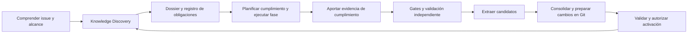

# Repository Knowledge & Learning

Propuesta de diseño, 10 de octubre de 2026. Complementa el [contraste de ECC](ecc-contrast-2026-10-10.md). No describe una funcionalidad implementada ni introduce configuración válida en el runtime actual.

## Resultado esperado

Antes de cada una de las cuatro fases, el ciclo descubre y consulta instrucciones, documentación, skills y aprendizajes pertinentes del proyecto. Convierte las instrucciones aplicables en obligaciones verificables y exige evidencia de cumplimiento. Después, puede extraer y consolidar conocimiento respaldado por evidencia, preparar cambios versionados y alimentar el descubrimiento de ciclos posteriores.

El repositorio es la fuente de verdad. Markdown y skills se conservan en Git; SQLite, AgentMemory y otros índices se reconstruyen desde esos archivos. La captura de candidatos es automática cuando el aprendizaje está habilitado. La activación como instrucción requiere autorización; guardar un candidato no lo convierte en regla.

El sistema aprende también de implementación, pruebas, decisiones, incompatibilidades y preparación del entorno. Un finding corregido es una fuente valiosa, pero no es la única.

## Compatibilidad y ubicación

El [README](../README.md) permite que las convenciones del proyecto sustituyan defaults y no exige archivos de instrucciones. Discovery respeta ese contrato: funciona sobre las fuentes existentes, sin exigir una estructura nueva ni escribir en el checkout.

Con aprendizaje habilitado se configura un destino permitido. Una estructura posible es:

```text
.code-cycle/
  knowledge/
    index.md
    architecture/
    conventions/
    testing/
    lessons/
  skills/
    database-migrations/SKILL.md
```

Es ilustrativa, no obligatoria. `docs/`, skills y decisiones existentes siguen siendo válidos donde estén. Las skills aprendidas del proyecto se separan del paquete operativo `cc-*`; no se instalan globalmente de manera automática.

La documentación explica; una skill describe un procedimiento aplicable, con condiciones y verificaciones. No se convierte toda la documentación en skills. Tampoco un fichero denominado `SKILL.md` adquiere autoridad o compatibilidad con todos los hosts por su nombre.

## Flujo de descubrimiento



Discovery es obligatorio en implement, initial-review, resolve y rereview; Learning es optativo. Omitir issue-review o continuar una implementación no debe omitir Discovery. Cada fase tiene su receipt y reutiliza fuentes vigentes, ampliándolas según su rol. Review y rereview consultan el conocimiento sin modificarlo ni reducir la revisión acumulada exigida. Las invocaciones standalone deben seguir el mismo procedimiento; solo el runtime o un wrapper supervisado puede garantizar su enforcement. Una skill ejecutada directamente sin ese control tiene garantías procedimentales limitadas.

La skill común propuesta es `cc-knowledge-discovery`, parametrizada por fase y alcance, con mecanismo local compartido. Su definición no exige otro agente ni otro dispatch. `cc-knowledge-learning` y, si conviene, `cc-knowledge-consolidate` separan extracción y preparación de cambios; estos nombres son propuestas, no skills instaladas por este documento.

Algoritmo inicial, determinista y local:

1. Resolver instrucciones efectivas del host, del repositorio y de los directorios afectados, incluidas las referencias que exigen consultar. No usar solo una búsqueda de archivos dentro del root si el host ha cargado políticas de ancestros.
2. Identificar subsistemas por issue, rutas, símbolos y dependencias; declarar incertidumbre cuando aún no se conoce el alcance.
3. Enumerar documentación y skills del proyecto a través de ubicaciones configuradas, convenciones existentes y referencias explícitas. Evitar secretos, artefactos generados y recorridos fuera de límites autorizados.
4. Seleccionar por rutas, lenguajes, responsabilidades y temas. Los documentos existentes sin metadatos se descubren por referencias, títulos y contenido; no se exige migrarlos.
5. Leer el contenido pertinente y ampliar cuando falten respuestas. Las políticas aplicables no se descartan por baja puntuación, falta de keywords o presupuesto.
6. Emitir un dossier y un registro de obligaciones con fuentes consultadas, versión, autoridad, condiciones, cobertura, conflictos, descartes y gaps. Una consulta fallida no se registra como búsqueda sin resultados.

Serena puede ayudar con símbolos; la recuperación semántica es complementaria. Ante caída de un índice opcional, se usa búsqueda local y se registra degradación. Si una política explícitamente requerida no puede leerse, el trabajo dependiente se detiene con motivo concreto. Si no hay documentación pertinente, continúa con `no_relevant_knowledge`; no se inventa conocimiento.

El presupuesto limita antecedentes y ampliaciones, no autoriza ignorar restricciones. Si la lectura obligatoria no cabe, se divide el trabajo o se utiliza un contexto adecuado antes de actuar.

## Obligation Registry & Compliance Evidence

Forma parte integral del MVP de Discovery: no es una base de datos nueva ni una tercera iniciativa. El registro es un artefacto estructurado y versionado por esquema, ligado al trabajo, al checkout y a las fuentes que originan las obligaciones. Su persistencia operativa sigue la retención de evidencia del ciclo; no exige añadirlo al repositorio destino.

El mecanismo determinista acredita recuperación, versiones y entrega de contenido al contexto del agente. No demuestra comprensión ni aplicación. La extracción semántica de instrucciones también puede equivocarse: debe mantener referencias a las fuentes y someter su cobertura a validación. Ningún receipt debe afirmar que un proceso leyó una fuente cuando solo la enumeró, ni aceptar una declaración del agente como prueba de entrega o cumplimiento.

### Identidades, aplicabilidad y procedencia

Cada obligación conserva:

| Campo | Contrato |
| --- | --- |
| Identidad y revisión | `obligation_id` estable entre fases, con revisión explícita cuando cambian sus condiciones o exigencias. El hash de un documento no es la identidad de la obligación. |
| Fuente y autoridad | Ruta, sección, versión/hash, origen y categoría de autoridad. Candidatos y antecedentes no generan obligaciones normativas por relevancia. |
| Aplicabilidad | Rutas, componentes, condiciones, fases afectadas y motivo. Distinguir obligatoriedad de recomendaciones informativas. |
| Comprobación exigida | Resultado esperado y método válido: gate, prueba, inspección independiente u otro control autorizado. No exigir tests artificiales para juicios cualitativos. |
| Plan y evidencia | Acción prevista, referencias al código/artefactos, ejecución, resultado observado y commit o árbol de trabajo evaluado. |
| Propuesta y validación | Estado propuesto por el ejecutor, estado confirmado, identidad/rol del validador, método, razonamiento y referencias comprobadas. |

Un receipt por fase enlaza la revisión del registro, identidad del trabajo/ciclo/intento, rol, checkout, alcance y versiones de las fuentes. Se valida también el inventario pertinente: hashes intactos no detectan por sí solos una nueva política o un subsistema añadido. Reutilizar un dossier no permite omitir las obligaciones específicas del rol siguiente.

### Extracción y aplicabilidad incierta

El sistema separa tres operaciones: identificar una instrucción con autoridad, estructurar su exigencia y determinar si aplica al trabajo. Un título, una coincidencia de palabras o una puntuación semántica no resuelve ninguna de las tres por sí solo.

1. **Fuentes estructuradas:** normalizar reglas declaradas por el proyecto, procedimientos aprobados y metadatos con esquema válido. Resolver rutas, versiones y condiciones evaluables mediante código local. Reutilizar extracciones ya validadas cuando la fuente y el método no hayan cambiado.
2. **Markdown libre:** conservar el fragmento y sus referencias; clasificar su carácter normativo según autoridad y contexto, evitando convertir ejemplos o recomendaciones en requisitos. Una interpretación semántica prepara una propuesta, no una regla confirmada por el mero hecho de que un modelo la haya generado. Cuando sea posible, este razonamiento se integra en el trabajo ya requerido del agente o revisor; no se añade un extractor LLM por fase.
3. **Estructuración:** registrar acción o restricción, condición de aplicación, resultado exigido y comprobación admisible. No inventar comandos ni resultados esperados ausentes de la fuente. Las instrucciones cualitativas se marcan para inspección independiente razonada; `manual_review` no significa que puedan omitirse.
4. **Cobertura:** mantener un mapa de secciones normativas consultadas a obligaciones, duplicados vinculados o fragmentos pendientes de interpretación. No tratar una extracción vacía como ausencia de instrucciones. La revisión contrasta ese mapa con las fuentes originales, además de evaluar las obligaciones extraídas.

La aplicabilidad tiene un eje separado del resultado de cumplimiento: `applicable`, `not_applicable` o `undetermined`, acompañado de condiciones, hechos observados y motivo. `not_applicable` propuesto no confirma la exclusión del registro; requiere validación. La confianza numérica puede ayudar a ordenar consultas, pero no decide que una obligación desaparezca.

| Incertidumbre | Tratamiento |
| --- | --- |
| Condición determinable localmente | Resolver con rutas, versiones, símbolos o configuración y registrar los hechos. |
| Duda sobre una restricción obligatoria que afecta a la acción siguiente | Mantener la obligación y bloquear esa acción hasta resolver la interpretación o aplicabilidad. Permitir inspección sin efectos para aclararla. |
| Obligación cualitativa cuya aplicabilidad es clara | Planificar cumplimiento y validación independiente; no bloquear por carecer de test automático. |
| Duda material que necesita criterio del proyecto | Solicitar aclaración a la autoridad adecuada; no aplicar por defecto la interpretación más permisiva ni una restricción inventada más amplia. |
| Antecedente sin autoridad normativa | Conservar como contexto, sin convertirlo en gate obligatorio. |

`undetermined` describe incertidumbre sobre aplicabilidad; `unverified` describe una comprobación inconclusa. No se sustituyen. La primera impide acciones dependientes de una restricción obligatoria y ambas impiden declarar conformidad cuando no se ha resuelto la exigencia. La preparación para aclararlas no cuenta como permiso para editar ni como comienzo del trabajo sustantivo.

Si una interpretación imprescindible no puede obtenerse localmente ni mediante razonamiento ya disponible, se hace explícito ese bloqueo. Un paso semántico adicional es excepcional y sujeto a presupuesto; no se simula extracción determinista de todo Markdown para mantener una cifra de coste cero.

### Estados de obligaciones

| Estado | Significado |
| --- | --- |
| `pending` | Aplicable, todavía sin evidencia suficiente. |
| `satisfied` | Cumplimiento acreditado por un control válido y confirmado por un validador autorizado. |
| `violated` | Evidencia de incumplimiento. |
| `not_applicable` | Exclusión justificada y validada; no es una excepción a una obligación que sí aplica. |
| `unverified` | Se intentó verificar y la evidencia no permite concluir. |

Estos estados son distintos del estado del conocimiento (`candidate`, `approved`, etc.). El implementador o resolver aporta evidencia y propone un resultado; no confirma unilateralmente `satisfied` ni su propia exclusión. Un gate solo confirma las condiciones que realmente comprueba. La ejecución de un test por el agente no convierte cualquier obligación relacionada en satisfecha.

Una revisión independiente razonada puede confirmar obligaciones cualitativas. Debe contrastar fuentes, código y evidencia, no ratificar etiquetas. La identidad de quien valida y el control ejecutado quedan registrados. El resultado `unverified` se conserva: no implica automáticamente incumplimiento, pero tampoco conformidad.

### Responsabilidades por fase

| Fase | Obligaciones y evidencia |
| --- | --- |
| Implement | Descubrir, explicitar plan de cumplimiento antes de editar y aportar evidencia de los cambios. |
| Initial-review | Validar cobertura y aplicabilidad del registro, contrastar evidencias y buscar también defectos no documentados. |
| Resolve | Actualizar el alcance y las obligaciones afectadas, corregir incumplimientos y aportar nueva evidencia sin borrar resultados anteriores. |
| Rereview | Confirmar correcciones y revalidar evidencia afectada por el nuevo head, preservando cobertura acumulada y revisión general. |

Una evidencia anterior se reutiliza solo cuando el control sigue siendo válido para el estado actual y se justifica por qué los cambios no la afectan. No basta con que el archivo de políticas mantenga el mismo hash. Cambios de código o dependencias pueden exigir repetir verificaciones.

### Control de cambios del registro entre fases

El coordinador/runtime es el único escritor del registro canónico operativo. Los agentes emiten propuestas y evidencias por canales estructurados; no pueden reemplazarlo con un JSON propio. El registro y sus receipts se mantienen fuera de los directorios escribibles por implement/resolve, con protección efectiva del entorno. Un hash detecta cambios, pero no sustituye ese control de escritura. Un adapter sin aislamiento suficiente debe declarar la limitación o bloquear el modo de enforcement fuerte.

Cada cambio contiene identidad del actor atribuida por el runtime, `expected_revision`, tipo de operación, obligación, fuente, motivo, evidencia y validación. La identidad no se acepta solo de un campo que rellene el agente. El runtime valida esquema, permisos y revisión esperada, aplica la operación y conserva el evento anterior. Cambios concurrentes sobre revisiones obsoletas se rechazan y deben reconciliarse.

| Actor | Puede proponer | Puede autorizar |
| --- | --- | --- |
| Implement / resolve | Nuevas obligaciones, ampliaciones, aclaraciones, evidencias, correcciones de extracción y exclusiones justificadas. | Ninguna reducción normativa, exclusión propia o confirmación unilateral de cumplimiento. |
| Initial-review / rereview independientes | Omisiones, correcciones, resultados y exclusiones fundamentadas en la fuente. | Validación de evidencia y aplicabilidad dentro de su contrato; no una dispensa de políticas del proyecto. |
| Validador determinista | Resultados respaldados por controles y condiciones formalizadas. | Solo conclusiones cubiertas por el control ejecutado, no interpretaciones nuevas de texto ambiguo. |
| Autoridad del proyecto autorizada | Cambio explícito de política o excepción delimitada. | Cambios normativos dentro de su autoridad, sin alterar límites efectivos del entorno ni historia. |
| Runtime / coordinador | Validar y materializar operaciones autorizadas. | No decide por sí mismo una excepción semántica para superar el gate. |

Una propuesta de adición normativa se conserva con su fuente y debe resolverse antes de la acción dependiente si revela una posible omisión obligatoria. No adquiere autoridad normativa solo porque implement la proponga. Los revisores pueden emitir cambios del registro mediante resultados estructurados sin escribir archivos del repositorio.

Modificar una obligación crea una revisión nueva. Reducir alcance, obligatoriedad o comprobaciones requiere validación independiente contra la fuente; si cambia la política en lugar de corregir su interpretación, requiere autorización del proyecto. **Descartar no significa borrar:** un duplicado se enlaza con su obligación canónica y una extracción incorrecta conserva motivo y validación. Ninguna desaparición silenciosa del conjunto anterior se acepta como un registro completo.

Si implement/resolve cambia una fuente normativa en su rama, el hash nuevo invalida la extracción correspondiente y genera un conflicto o delta de política pendiente. El sistema no adopta automáticamente la versión más permisiva para aprobar esa misma implementación. Hasta su autorización, permanece la exigencia anterior para las acciones que dependan de ella; el cambio de política puede revisarse por separado. Las obligaciones adicionales descubiertas conservan procedencia y no reescriben resultados históricos.

### Gates de entrada y salida

**Entrada:** antes del trabajo sustantivo, runtime o wrapper valida Discovery vigente, cobertura del alcance suficientemente justificada, registro válido y ausencia de conflictos obligatorios sin resolver. Una búsqueda vacía legítima no bloquea; una fuente requerida ilegible, una cobertura obligatoria desconocida o un receipt inválido sí bloquean la acción dependiente. Los permisos efectivos siguen imponiéndose durante toda la fase, aunque su receipt sea válido.

**Salida de conformidad:** las obligaciones aplicables deben tener un resultado validado y evidencia verificable. Las obligatorias en `pending`, `violated` o `unverified` impiden declarar conformidad satisfactoria. Una exclusión `not_applicable` necesita validación; una excepción a una obligación aplicable exige autorización explícita, alcance y motivo, sin falsear su estado ni dispensar límites que el autorizador no puede modificar.

El estado de conformidad se separa del fin de ejecución y del verdict de review. Implement puede entregar código y evidencia **pendientes de validación independiente** para que se despache review; no puede declararse conforme por ese hecho. Initial-review puede terminar correctamente su trabajo con `CHANGES_REQUESTED` y obligaciones violadas. Si ejecutar requiere un requisito previo incumplido, se emite bloqueo; si el producto incumple una obligación, se entra al bucle de corrección. Esta distinción evita esperar una review antes de permitir que esa review arranque.

El contrato estructurado futuro debe expresar esas diferencias; este diseño no redefine silenciosamente los enums del runtime actual. Un cierre satisfactorio del producto, incluido `READY_FOR_MANUAL_MERGE`, exige conformidad validada y los gates generales existentes. El registro no sustituye review, tests ni comprobaciones fuera de lo ya documentado.

### Historia y aprendizaje

Las validaciones se añaden con su versión, evidencia y estado evaluado; no se sobrescriben para aparentar que un incumplimiento nunca existió. Continuous Learning puede consumir incumplimientos, resultados inconclusos y exclusiones justificadas, además de correcciones verificadas.

Un aprendizaje posterior no modifica retroactivamente el registro utilizado en una evaluación anterior. Una política nueva puede originar una revisión explícita para una fase futura; conserva origen, diferencia y motivo, sin permitir cambiar las reglas para aprobar el mismo resultado fallido. La automatización avanzada que genera tests a partir de instrucciones es posterior; trazabilidad, estados, evidencia y gates básicos forman parte del MVP.

### Coste operativo y reutilización

El camino normal no añade un dispatch de modelo para Discovery ni otro para Compliance. Enumeración, hashes, matching formalizado, validación de esquema, permisos y receipts se ejecutan localmente. La interpretación y validación cualitativa se incorporan a las fases ya necesarias, con entradas acotadas. Esto evita llamadas adicionales, pero no hace gratis el contexto ni el razonamiento: también se mide el aumento de tokens y duración de esas fases.

Se separan tres capas para no invalidar todo ante cualquier cambio:

| Capa | Clave y condición de reutilización |
| --- | --- |
| Extracción de fuentes | Identidad aislada del repositorio, manifiesto de fuentes con rutas/hashes, autoridad/configuración, versión de esquema y método de extracción. Reutilizar por fuente; una interpretación no validada sigue identificada como propuesta. |
| Selección de obligaciones | Extracciones vigentes, fingerprint de alcance y hechos usados en aplicabilidad, rol y contrato de fase. Ampliar solo las selecciones afectadas por cambios materiales. |
| Receipt y evidencia de fase | Trabajo/ciclo/intento, rol, revisión del registro y estado evaluado. Emitir un receipt propio por fase mediante código local; no reutilizar un receipt de implement como si fuera de review. Revalidar la evidencia por código y dependencias. |

Antes de un hit, el mecanismo local vuelve a comprobar el inventario pertinente, fuentes nuevas o eliminadas, cambios no commiteados, configuración y condiciones de alcance. Un TTL o la igualdad del head no sustituye esas comprobaciones. Las caches se aíslan por repositorio y autoridad; se reconstruyen desde fuentes y artefactos verificados, nunca conceden permisos.

Un nuevo head puede conservar extracciones y selección si no cambiaron sus entradas, aunque invalide evidencia de cumplimiento. Un nuevo rol puede reutilizar fuentes y obligaciones comunes, pero obtiene su propia selección y validación. Si falta un dato indispensable para probar vigencia, se registra miss o incertidumbre, no hit.

Ejemplo de camino sin cambios: la siguiente fase verifica inventario y fingerprints localmente, selecciona sus obligaciones, emite un receipt nuevo y recibe únicamente instrucciones pertinentes y referencias a la evidencia. No vuelve a pedir al modelo que resuma los mismos documentos ni contrata un validador adicional. El reviewer existente sigue examinando código, evidencia y cobertura; una cache no reemplaza su independencia.

Cuando exista ambigüedad nueva imprescindible, una llamada adicional debe nombrar la pregunta pendiente, registrar motivo y estimación, y respetar el presupuesto configurado de intentos/tokens/tiempo para esta capacidad. El MVP tiene por defecto un presupuesto de cero dispatches adicionales; habilitar un paso semántico separado requiere una política configurada con límites finitos. No hay bucles ilimitados de reextracción. Agotar el presupuesto conserva el resultado inconcluso y bloquea la acción dependiente cuando corresponde; no cambia el estado a `satisfied` ni descarta la obligación. Los permisos y autorizaciones ya existentes siguen aplicándose, sin pedir aprobación por cada cache miss.

Métricas mínimas, sin cuerpos de documentos: hits/misses por capa y motivo, fuentes realmente releídas, volumen entregado al agente, tiempo local, llamadas adicionales y motivo, uso medido atribuible cuando esté disponible y checks repetidos/evitados. No atribuir al Discovery todo el consumo de una fase por carecer de desglose. El piloto compara coste y tiempo por tarea completada junto con cobertura y calidad.

## Contrato compartido de conocimiento

Los documentos generados contienen metadatos legibles y un cuerpo Markdown. Discovery también soporta documentación preexistente sin este esquema. Propuesta conceptual de campos:

| Campo | Significado |
| --- | --- |
| `schema`, `id`, `title`, `kind` | Versión del formato, identidad estable y tipo: descripción, decisión, lección o procedimiento. |
| `status` | `candidate`, `validated`, `approved`, `deprecated` o `rejected`. |
| `scope`, `applies_to` | Proyecto y condiciones por rutas, lenguajes, versiones, contratos y temas. |
| `trigger`, `recommendation`, `limitations` | Cuándo consultar/aplicar, qué hacer y hasta dónde está respaldado. |
| `evidence` | Referencias reproducibles a repo, issue/PR, commit, intento, prueba, decisión o finding, cuando existan. |
| `counterevidence`, `supersedes` | Contradicciones y relaciones con conocimiento anterior. |
| `approval` | Autoridad que autorizó la activación y su alcance; no una simple afirmación del agente. |
| `validity` | Estado `current`, `needs_review` o `invalidated`, con motivo y dependencias relevantes. |
| `confidence` | Valor auxiliar, acompañado de su método/origen; no una puerta automática de activación. |

La evidencia identifica lo observado y los controles ejecutados. Una afirmación de un agente no sustituye la evidencia. Las decisiones autorizadas pueden ser conocimiento válido aunque no requieran un test. Los cambios de código no verificados se conservan como candidatos, con sus límites explícitos.

Un `REV-003` debe estar asociado a su repo y PR. Para acumular confianza se distinguen casos independientes de rereviews del mismo caso. Consolidar evidencias no significa multiplicar observaciones por cada intento.

La aprobación normativa y la vigencia son ejes distintos:

| Estado | Tratamiento |
| --- | --- |
| `candidate` | Persistible; antecedente identificado, nunca instrucción. |
| `validated` | Contexto con evidencia, sin autoridad normativa automática. |
| `approved` y vigente | Aplicable como procedimiento/regla dentro del alcance autorizado. |
| `approved` con vigencia dudosa o invalidada | No activar automáticamente; señalar la necesidad de revalidación. |
| `deprecated` | Conservar trazabilidad y sustituto; no aplicar. |
| `rejected` | Conservar cuando evita repetir propuestas; no aplicar. |

Una contradicción explícita prevalece sobre un score alto. Las políticas explícitas del proyecto no se desactivan silenciosamente mediante esta maquinaria: sus conflictos se exponen y resuelven según la autoridad correspondiente.

## Autoridad y seguridad

La relevancia de búsqueda no otorga autoridad. Issues, comentarios, ejemplos y candidatos se tratan como datos. Una skill aprendida no puede habilitar escritura para un reviewer, eludir controles obligatorios ni conceder credenciales.

La jerarquía del diseño respeta instrucciones superiores, autorización actual del usuario y límites efectivos del entorno. Dentro del contexto del proyecto:

1. Aplicar los contratos y permisos efectivos de la ejecución; un documento no puede ampliarlos.
2. Resolver instrucciones autorizadas del repositorio y su alcance. Estas pueden sustituir defaults del toolkit, como promete el README.
3. Consultar procedimientos aprobados del proyecto, subordinados a esas instrucciones.
4. Utilizar conocimiento validado como contexto y candidatos como antecedentes a contrastar.

No se declara que toda regla del toolkit sea superior a las instrucciones del usuario. Se distingue un default sustituible de una restricción efectiva. Los conflictos materiales bloquean la acción afectada o se resuelven por autoridad; nunca por similitud semántica.

## Extracción, consolidación y escritura

Con Learning habilitado, las etapas emiten observaciones candidatas fuera del checkout cuando su rol es solo lectura. La captura no ejecuta instrucciones embebidas ni guarda secretos, logs completos o datos de clientes.

Un paso separado prepara cambios en un workspace de escritura autorizado:

1. Clasificar observaciones y comprobar procedencia, commit y evidencia disponible.
2. Buscar equivalentes en el repositorio, también en rechazados y deprecados.
3. Consolidar evidencia sobre el mismo conocimiento. Mantener separados casos con condiciones incompatibles.
4. Proponer una actualización de documentación existente o un candidato nuevo. No sobrescribir normas aprobadas desde una observación.
5. Preparar diff revisable e índice actualizado, sin modificaciones silenciosas en `main` ni merge automático.

Si dos ciclos parten del mismo estado y proponen lo mismo, un identificador estable, una comprobación antes de publicar y la reconciliación del diff evitan duplicados. Conflictos de consolidación se muestran; no se decide por el último escritor.

La ubicación en la PR de producto o en otra PR depende del alcance. Si se extrae después de la rereview final, una PR separada evita alterar el head ya verificado. Si se añade al mismo branch, cambia el head y deben repetirse los controles pertinentes. Descubrir una lección nunca habilita a `cc-rereview` para escribirla.

La preparación automática de candidatos no requiere aprobar cada observación. Activar reglas sí requiere aprobación o autorización previa explícita para una categoría delimitada de bajo riesgo, con auditoría y posibilidad de revocación. Generar una skill compatible requiere además validar su formato y procedimiento para los hosts objetivo.

## Vigencia, límites y recuperación

Discovery contrasta hashes/versiones y dependencias declaradas con el checkout actual. Cambios en rutas, contratos o dependencias relacionadas marcan procedimientos aprendidos para revisión cuando puedan afectar su validez; no borran el historial. Una fuente desaparecida o un índice stale obliga a recuperar del repositorio y rehacer el dossier.

Desde el MVP se excluye conocimiento rechazado, deprecado o invalidado de la activación. Una fase posterior puede mejorar detección de invalidaciones y promoción a skills; no puede posponer los límites básicos de autoridad.

El crecimiento se controla con deduplicación, consolidación, presupuestos de recuperación y revisión de obsolescencia. La eliminación de conocimiento aprobado sigue las reglas de cambios del proyecto. Git permite revisar evolución y revertir cambios; revertir una regla también invalida su caché.

## Dossier y observabilidad

El dossier incluye identidad del trabajo, checkout/base/head, fuentes con hashes y secciones, reglas aplicables, uso previsto, descartes relevantes, conflictos, faltantes y motivo de refresco. Es un artefacto acotado de contexto; el índice no sustituye las fuentes.

La telemetría conserva referencias, hashes, disponibilidad, cobertura declarada y métricas, no cuerpos de documentos ni narrativas de findings. Hay que definir retención y ubicación para dossiers y candidatos externos al checkout. [telemetry.md](telemetry.md) ya excluye esos contenidos y no debe convertirse en una base de conocimiento paralela.

Si cambia materialmente el alcance, Discovery amplía rutas y fuentes. Si cambia el head sin cambiar el alcance, revalida las versiones y vigencia; no repite ciegamente todo el reconocimiento.

## Integración con el código actual

La inspección local identifica puntos de integración, pero no acredita una ejecución funcional del diseño:

| Punto | Cambio futuro |
| --- | --- |
| [cc-implement-issue](../skills/cc-implement-issue/SKILL.md) y las otras tres skills de fase | Invocar la skill común de Discovery y exigir plan/evidencia según el rol, también en standalone. La lectura de instrucciones ya existe; no sustituirla por una búsqueda opcional. |
| [run_cycle.py](../scripts/run_cycle.py), `run_cycle()` | Garantizar entrada validada en las cuatro fases, incluyendo `--continue` y casos sin issue-review; comprobar registro y salida de conformidad sin impedir la review de evidencia pendiente. |
| [run_cycle.py](../scripts/run_cycle.py), `compose()` | Adjuntar dossier, obligaciones y referencias verificables sin incorporar toda la biblioteca. Evitar repetir Discovery entre driver y skill mediante receipt validado y específico de fase. |
| [cycle.py](../scripts/cycle.py), `ROLE_CONTRACTS` | Mantener roles existentes de solo lectura; un eventual writer de conocimiento necesita contrato explícito. El contrato por defecto de solo lectura no concede escritura. |
| [executors.py](../scripts/executors.py) | Usar límites de workspace efectivos y artefactos externos permitidos. No depender de hooks específicos de Claude para portabilidad. |
| [review_contract.py](../scripts/review_contract.py) y evidencia existente | Definir evidencia y validación de obligaciones, separando propuesta del ejecutor y confirmación independiente, sin debilitar resultados estructurados, recuperación ni validación por head/intento. |

Discovery no necesita convertirse en un nuevo agente ni en otro dispatch de modelo: enumeración, matching y control de versiones pueden ser código local; el agente consulta y aplica las fuentes al comprender el trabajo. La extracción automática puede reutilizar outputs acotados de las etapas y ejecutarse separadamente cuando sea necesario.

## Backlog y dependencias

| Trabajo propuesto | Alcance y dependencias reales |
| --- | --- |
| Nuevo: Repository Knowledge Discovery | Skill común, mecanismo local, dossier, Obligation Registry & Compliance Evidence, estados, autoridad/vigencia, receipts por fase y gates básicos en las cuatro fases. No depende de AgentMemory, del monitor o de resolver todos los bugs del runtime. |
| Nuevo: Repository Continuous Learning | Reutiliza el contrato anterior; captura y consolida candidatos, evidencia y cambios Markdown optativos. [#179](https://github.com/datacas/code-cycle-toolkit/issues/179) es necesaria para consolidar como completo el historial de reanudaciones; evidencia incompleta se marca y no promociona. |
| Posterior: Skill Promotion & Knowledge Validation | Procedimientos compatibles, evaluación de utilidad, contradicciones, invalidación avanzada y retirada. El control básico de activación existe desde las primeras fases. |
| [#184](https://github.com/datacas/code-cycle-toolkit/issues/184) | Reducir instrucciones conservando referencias y políticas obligatorias; probar que la reducción no elimina controles. Puede avanzar en paralelo. |
| [#144](https://github.com/datacas/code-cycle-toolkit/issues/144) | Alinear el scout de código con rutas y subsistemas de Discovery, evitando dos reconocimientos equivalentes. |

El desarrollo se desglosa en el [backlog de Discovery](repository-knowledge-discovery-backlog.md), publicado bajo la [issue de seguimiento #207](https://github.com/datacas/code-cycle-toolkit/issues/207) y diez entregas con dependencias y pruebas propias. El primer trabajo es [#208, contrato de fuentes](https://github.com/datacas/code-cycle-toolkit/issues/208). Los contratos compartidos se concretan antes de implementar; no se instala el esquema propuesto como configuración operativa. Los criterios 5 y 6 pertenecen a Continuous Learning y permanecen diferidos, sin atribuirlos al cierre de Discovery.

## Criterios de aceptación

1. Una tarea de `src/events/` encuentra fuentes pertinentes y procedimientos aprobados, con condiciones y versiones; la búsqueda no depende de un finding previo.
2. Una tarea sin documentación continúa con resultado de búsqueda explícito. Una política requerida ilegible detiene el trabajo dependiente con causa distinta.
3. AgentMemory/Serena ausentes o caídos no impiden recuperar fuentes locales; ningún índice stale activa una regla ausente o revocada.
4. Un dossier vigente se reutiliza sin duplicar reconocimiento; cambios materiales de alcance o fuentes obligan a refrescarlo antes de editar.
5. Candidatos de implementación, pruebas y correcciones se remontan a su procedencia. La evidencia incompleta no se presenta como validación.
6. Dos ciclos, incluidas propuestas concurrentes, consolidan un mismo aprendizaje sin duplicar skills ni contar rereviews como observaciones independientes.
7. Una skill contradicha, deprecada o invalidada deja de activarse; conserva evidencia y motivo. Un score alto no anula esa decisión.
8. Review y rereview siguen sin escritura. Un cambio posterior de conocimiento no reutiliza indebidamente la verificación de un head anterior.
9. El driver y wrapper supervisado impiden comenzar cualquiera de las cuatro fases sin Discovery vigente, también al continuar. Standalone comparte el procedimiento, documentando su menor garantía sin wrapper. Funciona con Claude Code, Codex y OpenCode sin exigir hooks de un host.
10. Pruebas con contenido malicioso, paths fuera de límites y conflictos de autoridad demuestran que fuentes recuperadas no conceden permisos ni rebajan controles.
11. Un piloto compara fallos repetidos, rondas de revisión, tiempo y coste por tarea completada entre trabajos comparables. Mide uso útil de conocimiento con evidencia y preserva cobertura; generar más documentos no cuenta como mejora.
12. Un dossier correcto con evidencia de cumplimiento ausente no permite declarar conformidad. Una autodeclaración `satisfied` o `not_applicable` sin validación se rechaza.
13. `pending`, `violated` y `unverified` se distinguen y bloquean conformidad cuando corresponden a obligaciones obligatorias. Se pueden emitir resultados estructurados de fallo/bloqueo y continuar la revisión o corrección cuando esté autorizada.
14. Un cambio de alcance, una política nueva o evidencia ligada a un head anterior invalida la reutilización injustificada; la identidad de obligaciones se conserva entre fases con revisiones explícitas.
15. Implement pendiente de validación alcanza initial-review sin ser declarado conforme. Una review con incumplimientos produce `CHANGES_REQUESTED`; el ciclo no queda esperando una validación que él mismo impide ejecutar.
16. El reviewer detecta defectos fuera del registro. Obligaciones cualitativas admiten revisión independiente razonada y las exclusiones/dispensas dejan autoridad y motivo verificables.
17. Un aprendizaje posterior o una edición de políticas no altera los resultados ni las obligaciones históricas del ciclo evaluado.
18. Markdown con reglas, ejemplos y recomendaciones produce un mapa de cobertura trazable; la extracción no convierte ejemplos en obligaciones ni inventa pruebas para reglas cualitativas. Una restricción material con aplicabilidad `undetermined` bloquea su acción dependiente y no desaparece por baja confianza.
19. Implement/resolve no pueden eliminar, rebajar o excluir unilateralmente obligaciones ni reemplazar el registro. Eliminar una entrada, falsear el actor o editar su fuente para evitar el gate provoca rechazo/conflicto explícito. Una revisión obsoleta en una actualización concurrente se rechaza.
20. Una corrección de extracción o un duplicado se conserva con validación e identidad anterior; un cambio normativo exige autoridad del proyecto. El revisor sigue sin escribir en el checkout.
21. Con fuentes, alcance y condiciones estables, las cuatro fases realizan Discovery mediante mecanismo local y sus dispatches ya previstos: **cero dispatches de modelo adicionales** por descubrimiento o validación de obligaciones. Cada fase conserva su receipt y responsabilidades independientes.
22. Un cambio de código que no altera conocimiento reutiliza extracciones, pero revalida la evidencia afectada. Una fuente nueva, modificación sin commit o ampliación del alcance impide un hit injustificado y solo rehace lo afectado.
23. Una ambigüedad que requiere razonamiento adicional consume un presupuesto explícito, registra causa y no provoca reintentos ilimitados. El piloto cuenta también tokens adicionales dentro de dispatches existentes y mantiene desconocido el consumo que no pueda atribuirse.

El orden de esta iniciativa es **Discovery → Continuous Learning → Promotion & Validation**, en paralelo a fiabilidad, reducción de contexto y observabilidad cuando las dependencias lo permitan.
