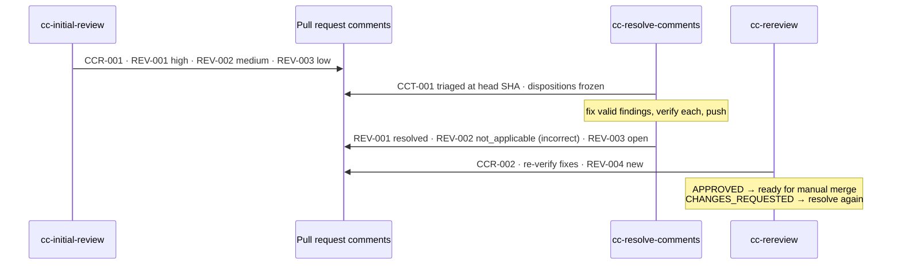

# Review lifecycle

How findings are created, tracked across rounds, and closed, and why the pull-request comment is the record the next run reads back.

**On this page:** [The loop](#the-loop) · [Anatomy of a review comment](#anatomy-of-a-review-comment) · [Finding fields](#finding-fields) · [Trusted authors](#trusted-authors) · [Security triage](#security-triage) · [Structured result](#the-structured-result-is-opt-in) · [Exit conditions](#exit-conditions)

## The loop



1. **Initial review** reads the whole diff from the merge base, runs its delegated passes, and publishes one comment with findings `REV-001`, `REV-002`, and so on.
2. **Resolution** first classifies *every* finding against one commit, then edits. Valid findings are fixed and verified. Rejected ones get a reasoned reply.
3. **Rereview** reads the whole accumulated diff again and reproduces each claimed fix. It classifies each previous finding and numbers new ones after the highest existing ID.
4. Repeat until approved, or until an orchestrator's iteration limit, no-progress guard, or repeated-findings ladder stops it (see [Exit conditions](#exit-conditions)).

Reviews always cover the **accumulated diff from the merge base to the current head**, never only the latest commit.

## Anatomy of a review comment

A published comment carries three kinds of machine-readable line. Their tokens stay in English whatever language the prose uses.

```text
#### [CCR-20260918-001] · senior_reviewer · anthropic/claude-sonnet-5→claude-sonnet-5 · high · schema:1
#### [CCT-20260918-001] · cheap_coder · openai/gpt-6-luna→? · high · triaged:0123…4567 · schema:1
#### [REV-004] · medium · resolved · valid · blocks:yes — Short title
```

| Line | Written by | Tokens |
|---|---|---|
| **Review run** `CCR-…` | each review or rereview, once per run | run ID · profile · `provider/requested→resolved` model · effort · schema |
| **Triage run** `CCT-…` | each resolver, once, before editing | run ID · profile · model · effort · `triaged:<sha>` (the commit every disposition was judged against) · schema |
| **Finding** `REV-…` | every publication of a finding | ID · severity · status · disposition · blocks — title |

`model_resolved` is what the **executor** reported having launched, never what the agent believes it is. When the executor doesn't report a model (Codex never does), the line shows `?`, which means "can't know" rather than "matched". When the runtime routed the stage, the profile, requested model, and effort are copied verbatim from the routing decision.

Without runtime routing, both review and triage lines use the reserved profile
`manual`, which is not configurable and never replaces supplied routing data.
Record the host-configured provider, model selector, and effort, not the agent's
self-description. Prefer effective values exposed by the active session. If the
host does not expose them, resolve only the relevant config keys, applying the
Codex order `-m`/`--model` or `-c`/`--config` override → trusted project
`.codex/config.toml` → selected `profile = ...`/`--profile` file under
`$CODEX_HOME` → `$CODEX_HOME/config.toml` (default
`$HOME/.codex/config.toml`). Read `model_provider` from the effective host
setting or CLI override, not project config. For Claude Code, use the active
session model and effort, including current `/model` and `/effort` selections;
if not exposed, follow the key's precedence across managed settings,
per-session `--model`/`--effort` or `--settings`/environment overrides, and
active project/local/user settings. The user file is `~/.claude/settings.json`.
Keep a configured alias such as `opus` as the model selector; do not expand it
to a versioned model ID. If the host exposes only a full ID, record that ID.
Read only the model/provider/effort values needed and never
print or copy unrelated configuration. Write `unknown` independently for any
unavailable value. `model_resolved` remains `?` without an executor receipt.

A skill that republishes a comment keeps every run line it didn't write.

## Finding fields

| Field | Values | Answers |
|---|---|---|
| ID | `REV-001`, `REV-002`, … | Stable for the life of the PR. Never renumbered or reused. New IDs continue after the highest one ever seen. |
| Severity | `critical` · `high` · `medium` · `low` | How bad the impact is. Delegated passes report P0–P3, and the cycle skill maps them. |
| Status | `open` · `resolved` · `not_applicable` | What happened to the code. It keeps moving between rounds. |
| Disposition | `valid` · `debatable` · `incorrect` · `obsolete` · `needs_clarification` · `-` | What the first resolver made of the finding. `-` means not triaged yet, and reviewers always publish `-`. |
| Blocks | `blocks:yes` · `blocks:no` | Whether it prevents approval. It is set independently of severity. |

**Status and disposition are orthogonal.** `resolved` + `valid` is an accepted finding that was fixed. `not_applicable` + `incorrect` is one the resolver rejected with reasons. `open` + `debatable` is still under discussion.

**Dispositions are frozen.** The first resolver assigns them, before editing and against the triage commit. They are never recomputed later. That way a disposition measures whether the finding was right when it was written, not what the code looks like after the fix. See [Instrumentation → Dispositions are frozen](instrumentation.md#dispositions-are-frozen).

**Rereview outcomes** for a previous finding: `resolved` (verified by running it), `still_open` (still reproducible, or fixed but unverified), `not_applicable` (its scope was removed or changed). A fix that is present but can't be verified is **not** `resolved`.

**Legacy headers** with four tokens (no disposition) predate this contract and read as `-`. They never block an open PR.

Other tokens that never translate: the functional statuses (`APPROVED`, `CHANGES_REQUESTED`, `RESOLVED`, `PARTIALLY_RESOLVED`, `BLOCKED`, `FAILED`, `READY_FOR_MANUAL_MERGE`, `HUMAN_INTERVENTION`) and every JSON key.

## Trusted authors

Later rounds recover findings from the PR's comment history, and a comment can be written by anyone. So recovery only folds in comments from logins listed in `review.trusted_authors`:

```yaml
code_cycle:
  review:
    trusted_authors:
      - your-login
      - your-review-bot
```

- Logins compare case-insensitively. Author identity comes from provider metadata, never from comment text.
- **No list, or an empty list, means no trusted authors.** A round that needs to recover history then stops with `BLOCKED`.
- `cc-provider-bootstrap` proposes the authenticated code-host login when the list is absent, and adds it only on confirmation. It never edits an existing list.
- The whole history is read in order. Other authors are ignored (and noted), and a malformed trusted comment is skipped rather than halting recovery.
- Ordinary discussion without contract headings starts an empty record.
- A later comment updates findings; it doesn't replace them. Leaving out an ID never deletes it. Two different titles under one ID are a collision, and recovery stops with `BLOCKED` rather than guessing.

## Security triage

Every review and resolution round decides whether `cc-security-review` runs:

```text
security_required = deterministic_rule OR reviewer_requests_security
```

- **The rule** matches changed paths, filenames, and PR labels against `security_review.always_when` (or the built-in defaults: auth, middleware, migrations, routes, and policies directories; lockfiles; Dockerfiles; `*.env.example`; labels meaning security, auth, privacy, data, secrets, or dependencies). See [Configuration → Security review rule](configuration.md#security-review-rule).
- **The reviewer** may add an audit for anything touching sessions, tokens, validation, public APIs, uploads, personal data, CORS, cookies, headers, deployment configuration, or dependencies. It can **never remove** one the rule fired.
- Declaring the rule replaces the defaults. Leaving it out keeps them, so a missing configuration can never switch the gate off.
- The comment always says whether the audit ran and which half fired. When nothing fired, it says the audit was skipped after triage. Silence is not a triage result.

`scripts/security_gate.py` is the reference implementation.

## The structured result is opt-in

`ORCHESTRATION_RESULT`, a strict JSON block with IDs, statuses, and SHAs, is emitted only when:

- you ask for it (`--json`, `--orchestration-result`, "with the structured result");
- a worker contract requires it;
- the status is `BLOCKED` or `FAILED`, or no comment could be published.

When it is emitted alongside a published comment, it is collapsed in a `<details>` element there, not repeated in the response. Otherwise the published comment, with the headers above, is the record. See [Instrumentation → The comment is the record](instrumentation.md#the-comment-is-the-record).

## Exit conditions

An orchestrator reports `READY_FOR_MANUAL_MERGE` only when **all** of these hold on the code host:

- the last review status is `APPROVED`;
- `reviewed_head_sha` equals the current head;
- no open finding has `blocks:yes`;
- required checks passed. Pending, skipped, failed, or missing checks are not success.

A human still owns the merge.

The loop stops early with `HUMAN_INTERVENTION`, before another resolution is dispatched, on any of these:

| Stop | When | Recorded as |
|---|---|---|
| Iteration limit | the resolve+rereview budget is spent: `max_iterations`, default `3` in `run_cycle.py` and `6` in the orchestrator skills | `iteration_limit` |
| No progress | a rereview reports the same `head_sha` and the same open finding set as the review before it | `no_progress` |
| Repeated findings | one `REV-xxx` ID survived a claimed fix twice | `repeated_findings` |

**A finding survives a claimed fix** when a resolution publishes its ID as `resolved` or `not_applicable` and the next review reopens it as `open` (`still_open` in a rereview's result). The claim is the status, never the disposition: a finding triaged `valid` and left `open` is no claim; one triaged `incorrect` and published `not_applicable` is one. Each claim is judged by the next review only, and within one run the last header for an ID is its position. These do not count:

| Sequence | Why not |
|---|---|
| `open@CCR → open@CCT → open@CCR` | the resolver never claimed it; the no-progress guard and the limit cover it |
| `resolved@CCT → resolved@CCR` | a confirmed fix |
| `resolved@CCT → not_applicable@CCR` | the reviewer agreed it no longer applies |
| `resolved@CCR → … → open@CCR` with no claim between | a regression, reported as one |
| a claim whose next rereview had no readable result | no rejection was observed |

The ladder has two rungs. After the **first** survival, the next resolution is told which IDs survived and must reproduce each with the reviewer's reproduction before editing, re-derive its cause, and not republish it `not_applicable` without new evidence; otherwise it reports `PARTIALLY_RESOLVED` and says the finding is contested. The **second** survival of the same ID stops the loop. Neither rung changes a model, profile, provider, or disposition.

The no-progress guard alone misses this pattern: a resolver that pushes a commit which does not fix the finding changes the head. On PR #74, `REV-001` went `open → resolved → open → not_applicable → open` across three reviews and nothing stopped it.

`review_contract.claimed_fix_survivals` is the single definition. It reads parsed comments for analysis, and `run_cycle.py` feeds it the structured results of the current run. A resumed cycle (`--from`) starts at zero survivals, so it can stop later than a whole cycle would, never earlier. Both orchestrator skills apply the same ladder, and the package validator checks that they state it.

---

[← Skills reference](skills.md) · [↑ Documentation index](README.md) · [Verification →](verification.md)
