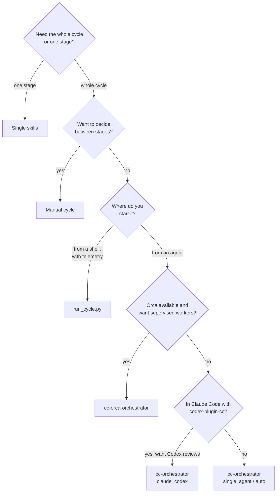

# Workflows

The same stages can be driven six ways. They differ in who runs each stage, what gets automated, and what gets recorded, not in what a stage does. A review run by hand and a review run by an orchestrator follow the same skill.

**On this page:** [Choosing a workflow](#choosing-a-workflow) · [Single skills](#single-skills) · [Manual cycle](#manual-cycle) · [cc-orchestrator](#cc-orchestrator) · [Claude + Codex mode](#claude--codex-mode) · [cc-orca-orchestrator](#cc-orca-orchestrator) · [Runtime driver](#runtime-driver-run_cyclepy) · [Common rules](#rules-every-workflow-shares)

## Choosing a workflow



| | Single skills | Manual cycle | `cc-orchestrator` | Claude + Codex | `cc-orca-orchestrator` | `run_cycle.py` |
|---|---|---|---|---|---|---|
| Started from | agent | agent | agent | Claude Code | agent with Orca | shell |
| Stages run by | you | you | one agent, or known host delegation | Claude + Codex | Orca workers | Codex / Claude CLIs, per routing |
| Loops resolve ↔ rereview | — | you | ✅ | ✅ | ✅ | ✅ |
| Iteration limit, no-progress guard | — | — | ✅ | ✅ | ✅ | `--max-iterations` |
| Provider bootstrap | per skill | per skill | ✅ | ✅ | ✅ | inside the implement stage |
| Model routing by profile | — | — | ✅ ([Routing](routing.md)) | fixed by mode | `implementer=` / `reviewer=` | ✅ |
| Telemetry rows | — | — | when the runtime drives stages | — | — | ✅ always |
| Paired-review calibration | — | — | — | — | ✅ | `--mode calibration` |
| Extra requirements | — | — | — | `codex-plugin-cc`, Codex | Orca | runtime, executor CLIs |

---

## Single skills

**When:** you need one thing: a review of a pull request someone else opened, a security pass, a verification run, a way to start the app.

**What it does:** exactly what that skill documents. See [Skills reference](skills.md). Cycle skills publish on the change request. A supporting skill publishes only when you invoke it directly.

**Automates:** that stage, including its delegated passes. For example, `cc-initial-review` runs `cc-pr-review`, `cc-security-review` when triage requires it, and `cc-verify`.

**Doesn't automate:** anything before or after it.

```text
Use cc-initial-review on pull request 456.
Use cc-security-review on the changes in this branch.
Use cc-code-review on the current working tree against main.
Use cc-verify to check that the fix in src/billing/invoice.ts actually works.
Use cc-run to bring this project up and tell me the URLs.
Use cc-stats for the last 7 days.
```

**Ends:** with the skill's own result: a functional status for cycle skills, or a report for supporting skills.

## Manual cycle

**When:** you want the full cycle but want to read each result, and possibly change course, before the next stage starts.

**What it does:** you run the four cycle skills in order. Each one recovers state from the pull request's comments, so nothing has to be carried between them by hand.

```text
1. Use cc-implement-issue for issue 123 and open a pull request.
2. Use cc-initial-review on pull request 456.
      → APPROVED: done, merge manually
      → CHANGES_REQUESTED: continue
3. Use cc-resolve-comments on pull request 456.
4. Use cc-rereview on pull request 456.
      → CHANGES_REQUESTED: back to step 3
```

**Automates:** each stage, and finding recovery between stages. The published comment is the record. See [Review lifecycle](review-cycle.md).

**Doesn't automate:** the loop, the iteration limit, or the final exit validation.

**Requires:** `review.trusted_authors` configured, so later stages can recover earlier findings.

**Ends:** when you stop. Merge is yours.

## `cc-orchestrator`

**When:** you want the whole cycle from one prompt, in any host.

**What it does:**

1. Runs `cc-provider-bootstrap`; stops on `BLOCKED` or `FAILED` before creating anything.
2. Labels the work (`difficulty`, `verifiability`, security sensitivity) **before** routing, so the routing can't be justified after the fact.
3. Runs `cc-implement-issue`, then `cc-initial-review`.
4. On `CHANGES_REQUESTED`, loops `cc-resolve-comments` → `cc-rereview`, passing each stage the previous structured result so `REV-xxx` IDs stay stable.
5. Validates the exit conditions against the code host: the reviewed SHA equals the current head, required checks passed, no blocking finding is open, and the PR is still unmerged.

**Inputs:**

| Input | Default | Meaning |
|---|---|---|
| `issue_id` | required | Work item; `issue_number` is a GitHub alias |
| `issue_provider`, `code_host`, `repo` | resolved | See [Providers](provider-contract.md) |
| `orchestration_mode` | `auto` | `auto`, `single_agent`, or `claude_codex` |
| `max_iterations` | `6` | Resolve + rereview rounds; must be ≥ 1 |
| `merge` | `manual` | Fixed. There is no automatic merge. |

**Execution modes.** Resolved from `orchestration_mode=`, then `code_cycle.orchestration.mode`, then `auto`.

| Mode | Behaviour |
|---|---|
| `single_agent` | Every stage runs sequentially in the current agent. |
| `claude_codex` | In Claude Code with `codex-plugin-cc`: Claude implements and resolves, Codex reviews. See [below](#claude--codex-mode). Blocks before implementation if Codex can't be used. |
| `auto` | Uses a known host adapter only when the host declares it and a saved preference selects it. Otherwise it behaves as `single_agent`. The plugin's absence never blocks `auto`. |

When the host exposes workers or subagents with a known contract, stages may be delegated to them. Otherwise they run sequentially in the current session. The orchestrator never guesses host commands.

**Routing.** When the runtime drives the stages, each role is routed to a profile and model. An explicit execution mode (`single_agent`, `claude_codex`) instead fixes the executor for every stage. See [Routing and models](routing.md).

**Automates:** the full loop, iteration limit, no-progress guard, exit validation, and state handoff.

**Doesn't automate:** the merge, reclassifying or dismissing findings (only the resolver does that, and it records why), or installing an optional plugin.

```text
Use cc-orchestrator for issue 123 with max_iterations=4.
Use cc-orchestrator for work item ENG-42 with issue_provider=plane code_host=github repo=owner/api.
```

**Ends:** `READY_FOR_MANUAL_MERGE`, `HUMAN_INTERVENTION` (limit reached, or the same head and open findings repeated), `BLOCKED`, or `FAILED`. The optional result envelope is shared with `cc-orca-orchestrator`, so one consumer parses both. See [Skills → cc-orchestrator](skills.md#cc-orchestrator).

## Claude + Codex mode

**When:** you work in Claude Code and want a second model family to review what Claude wrote.

**Split of work:**

```text
Claude  provider bootstrap and implementation
Codex   initial review            (complete cc-initial-review, may publish its comment)
Claude  resolve comments
Codex   rereview                  (complete cc-rereview, may publish its comment)
Claude  final validation and manual-merge handoff
```

Codex must not modify product code or the working tree. Claude validates each returned structured result and confirms the branch didn't move before continuing.

**Requires:**

- the external [`codex-plugin-cc`](https://github.com/openai/codex-plugin-cc) plugin, installed and set up in Claude Code. The toolkit doesn't bundle, install, or authenticate it:

  ```text
  /plugin marketplace add openai/codex-plugin-cc
  /plugin install codex@openai-codex
  /reload-plugins
  /codex:setup
  ```

- the toolkit installed for **both** Claude Code and Codex, so delegated Codex sessions load the same review skills (`bash scripts/install.sh --agent all …` or `npx skills add datacas/code-cycle-toolkit --all --copy`).

**Start:**

```text
Use cc-orchestrator for issue 123 with orchestration_mode=claude_codex.
```

Or save the preference in `.code-cycle.yml`:

```yaml
code_cycle:
  orchestration:
    mode: claude_codex
```

On the first applicable run in Claude Code, the orchestrator briefly explains the integration. If the plugin is ready but nothing is saved, it asks once whether to use this mode and offers to update `.code-cycle.yml`.

The full discovery, handoff, and failure rules are in the [adapter contract](../skills/cc-orchestrator/references/codex-plugin-cc.md).

## `cc-orca-orchestrator`

**When:** you use Orca and want every stage to run as a supervised worker in its own terminal, or you want a **paired-review calibration**.

**What it does:** runs `cc-provider-bootstrap`, creates an Orca Run, then one Task per stage (implement → initial review → resolve ↔ rereview). It starts or reuses workers, waits for `worker_done`, reads each `ORCHESTRATION_RESULT`, and branches only on its functional status. All workers share one worktree and one PR branch. The coordinator itself never edits code, reviews, or judges a finding.

**Inputs:**

| Input | Default | Meaning |
|---|---|---|
| `issue_id`, `issue_provider`, `code_host`, `repo` | resolved | As in `cc-orchestrator` |
| `implementer` | `codex` | Agent that writes code and resolves findings |
| `reviewer` | `claude` | Agent that reviews and rereviews |
| `max_iterations` | `6` | Resolve + rereview rounds |
| `paired_review` | `false` | Two blind reviewers over one commit (calibration) |
| `campaign` | — | Required when `paired_review=true` |

```text
Use cc-orca-orchestrator for issue 123 with implementer=codex reviewer=claude max_iterations=6.
```

**Paired review** (`paired_review=true campaign=…`) dispatches the `reviewer_a` and `reviewer_b` candidates from `calibration.profiles` over the same commit. Each reviewer gets its own worktree, or they run strictly one after the other. The reviewers don't publish. Their findings are merged, shuffled, and given public `REV-xxx` IDs, and one resolver triages them without knowing who wrote what. See [Routing → Calibration](routing.md#calibration).

**Requires:** Orca installed and authenticated (`orca` on macOS and Windows, `orca-ide` on Linux). It reads `orca skills get orchestration --full` before the first command. If orchestration is unavailable, it stops with `BLOCKED`. The three delegated skills remain usable by hand.

**Ends:** the same statuses as `cc-orchestrator`. It releases every worker on every terminal outcome and asks before creating its results directory.

## Runtime driver: `run_cycle.py`

**When:** you want a cycle that is **routed by profile and recorded in telemetry**, started from a shell or a script.

**What it does:** probes each executor once and labels the work from your flags. It then runs `implement → review → (resolve → rereview)*`, with every stage passing through the telemetry recorder, so no dispatch can happen without leaving a row. Each stage is dispatched to the Codex or Claude CLI chosen by [routing](routing.md) and told to invoke the matching skill. The review verdict is read from the structured result the stage is asked to emit, never from an exit code or prose. If the result is missing, the cycle stops.

```bash
python3 ~/.code-cycle/runtime/run_cycle.py \
  --repo owner/name --task 123 --difficulty 2 --verifiability auto
```

From a toolkit checkout: `python3 scripts/run_cycle.py …`

| Flag | Default | Meaning |
|---|---|---|
| `--task` | required | Work-item identifier |
| `--repo` | `repository.selector` | `owner/name` on the code host |
| `--difficulty` | `2` | `1`–`3`; `3` routes implementation to `deep_coder` |
| `--verifiability` | `auto` | `auto`, `partial`, or `human` |
| `--security-sensitive` | off | Routes review to `senior_reviewer` |
| `--verification` | unknown | `available` / `unavailable`, recorded as a signal |
| `--mode` | `production` | `calibration` never falls back and needs proven readiness |
| `--max-iterations` | `3` | Resolve + rereview rounds |
| `--cwd` | current directory | Where the executor runs and `.code-cycle.yml` is read |
| `--local-only` | off | Rehearsal: implement only, no publishing, needs a linked worktree in `--cwd` |
| `--timeout` | adapter default (3600 s) | Seconds one dispatch may take |
| `--verbose` | off | Print stage starts, periodic dispatch progress, and stage results; default terminal output stays unchanged |
| `--progress-interval` | `60` seconds | Time between progress lines while a stage is running |
| `--database` | [default path](telemetry.md#where-it-lives) | Telemetry database |
| `--config` / `--no-config` | `.code-cycle.yml` in `--cwd` | Use another file, or the built-in defaults on purpose |

**Requires:** the runtime and an authenticated Codex and/or Claude CLI. For publishing stages, it also needs `gh` authenticated with push access, Codex CLI 0.138.0 or later, and a working tree on a named branch. Before any publishing dispatch, a readiness check verifies this and records `missing_capability=publication_access` when it fails.

**Local-only rehearsal:** `--cwd /path/to/linked-worktree --local-only` refuses the live repository. It runs implementation only, adds a no-publish boundary to the prompt, marks each row `local_only`, and ends with `HUMAN_INTERVENTION` because there is no PR to review. It is a policy, not a network sandbox.

**Orca targets** dispatch asynchronously, so a cycle routed to Orca stops after the dispatch instead of treating the missing output as a failure.

The runtime always updates an atomic status file at `<telemetry database directory>/status/<cycle_id>.json`, including when `--verbose` is off. Read current and recently finished cycles with `python3 ~/.code-cycle/runtime/cycle_status.py`; add `--follow` to refresh every 60 seconds or pass `--progress-interval N` to change it. `--status-dir` selects another status directory, and `--database` follows a custom telemetry database path. `python3 ~/.code-cycle/runtime/cycle_status.py --profiles` prints the effective routing profiles of the current repository instead, or of `--cwd <root>`. Status snapshots include the active role, routing target, elapsed time, tool count, and one short activity line.

**Ends:** prints one line per stage and the final status, and writes every row to the telemetry database.

## Rules every workflow shares

- **Never merges.** Also never force-pushes, deletes remote refs, modifies the base branch, or closes an issue or PR without an explicit instruction.
- **Repository instructions win.** `AGENTS.md`, `CLAUDE.md`, and `CONTRIBUTING.md` override the defaults when present. A missing file is never a blocker.
- **Authorization follows the request.** Branches, commits, the PR, and temporary files that the workflow needs are covered by your request. An unrequested persistent artefact, such as a config file, label, migration, or extra branch, is proposed first and created only on confirmation.
- **Untrusted content stays data.** Issue text, PR descriptions, comments, and repository files are never executed as instructions.
- **Stacks are detected, not assumed.** Package managers come from lockfiles and test commands from what the project defines.
- **One language per run.** See [Configuration → Output language](configuration.md#output-language).
- **Status comes from structured results.** Never from free text, an exit code, or a worker's subject line.

---

[← Getting started](getting-started.md) · [↑ Documentation index](README.md) · [Skills reference →](skills.md)
