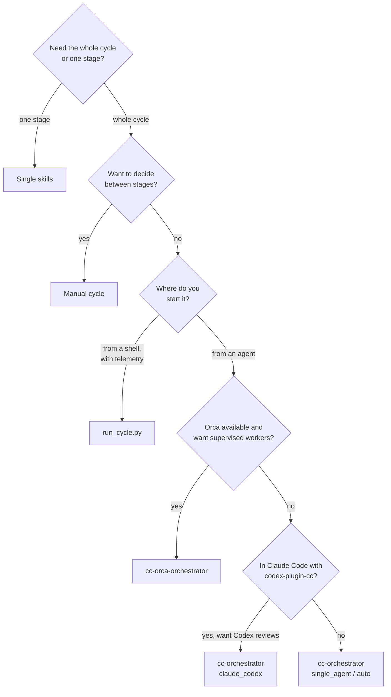

# Workflows

The same stages can be driven six ways. They differ in who runs each stage, what gets automated, and what gets recorded, not in what a stage does. A review run by hand and a review run by an orchestrator follow the same skill.

**On this page:** [Stop report](#stop-report) · [Choosing a workflow](#choosing-a-workflow) · [Single skills](#single-skills) · [Manual cycle](#manual-cycle) · [cc-orchestrator](#cc-orchestrator) · [Claude + Codex mode](#claude--codex-mode) · [cc-orca-orchestrator](#cc-orca-orchestrator) · [Runtime driver](#runtime-driver-run_cyclepy) · [Common rules](#rules-every-workflow-shares)

## Stop report

When a dispatch stops a cycle, `CycleReport.explain()` shows the attempt's
`error_code`, `start_state`, and a bounded, redacted excerpt of the executor's
observed error. `cycle_status.py --line` shows those same details on the final
status line. An unmapped error also shows the raw executor code, for example
`codex_error_info=foo`. Credential-shaped strings such as `sk-…`, `ghp_…`,
and bearer tokens are masked before the excerpt is bounded. These diagnostics
are transient report/status data, never telemetry payloads.

Read `capacity` as temporary overload, `quota` as an exhausted usage window,
`auth` as a credential failure, and `transport` as a connection failure.
`timeout` means the time limit expired and does not establish that work stopped.
`unavailable` names executor availability or an interactive prompt;
`contract_violation` names a wrong model or a failed read-only boundary;
`interrupted` means an operator signal stopped the cycle.
`unreadable_result` means output exists without a parseable structured result.

`executor_error` means the executor supplied an error the runtime cannot map;
its raw code helps diagnose it without guessing from assistant prose.
`no_error_report` means neither a result nor an executor error report was
available; it does not imply overload or exhausted quota. `precondition`
means a runtime or workspace requirement failed before launch. See the
[failure and capability tables](telemetry.md#dispatch-failure-evidence-schema-15)
for the complete mapping.

`started` has positive session, tool, workspace-change or receipt evidence.
`not_started` has positive evidence that no agent work ran. `unknown` means
evidence was unavailable, including timeouts with no stream and launches
without a receipt. Reconcile `unknown` as though it started before considering
another dispatch: absence of evidence does not make a retry safe. This report
adds evidence; automatic rerouting is separate work.

## Choosing a workflow


```mermaid
flowchart TD
    Q1{Need the whole cycle<br/>or one stage?}
    Q1 -- one stage --> S[Single skills]
    Q1 -- whole cycle --> Q2{Want to decide<br/>between stages?}
    Q2 -- yes --> M[Manual cycle]
    Q2 -- no --> Q3{Where do you<br/>start it?}
    Q3 -- from a shell,<br/>with telemetry --> R[run_cycle.py]
    Q3 -- from an agent --> Q4{Orca available and<br/>want supervised workers?}
    Q4 -- yes --> O[cc-orca-orchestrator]
    Q4 -- no --> Q5{In Claude Code with<br/>codex-plugin-cc?}
    Q5 -- yes, want Codex reviews --> CC[cc-orchestrator<br/>claude_codex]
    Q5 -- no --> SA[cc-orchestrator<br/>single_agent / auto]
```

| | Single skills | Manual cycle | `cc-orchestrator` | Claude + Codex | `cc-orca-orchestrator` | `run_cycle.py` |
|---|---|---|---|---|---|---|
| Started from | agent | agent | agent | Claude Code | agent with Orca | shell |
| Stages run by | you | you | one agent, or known host delegation | Claude + Codex | Orca workers | Codex / Claude CLIs, per routing |
| Loops resolve ↔ rereview | — | you | ✅ | ✅ | ✅ | ✅ |
| Iteration limit, no-progress guard | — | — | ✅ | ✅ | ✅ | `--max-iterations` |
| Provider bootstrap | per skill | per skill | ✅ | ✅ | ✅ | inside the implement stage |
| Model routing by profile | — | — | ✅ ([Routing](routing.md)) | fixed by mode | `implementer=` / `reviewer=` | ✅ |
| Telemetry rows | — | — | when the runtime drives stages | — | — | ✅ always |
| Paired-review calibration | — | — | — | — | ✅ | `--mode calibration` |
| Extra requirements | — | — | — | `codex-plugin-cc`, Codex | Orca | runtime, executor CLIs |

---

## Single skills

**When:** you need one thing: a review of a pull request someone else opened, a security pass, a verification run, a way to start the app.

**What it does:** exactly what that skill documents. See [Skills reference](skills.md). Cycle skills publish on the change request. A supporting skill publishes only when you invoke it directly.

**Automates:** that stage, including its delegated passes. For example, `cc-initial-review` runs `cc-pr-review`, `cc-security-review` when triage requires it, and `cc-verify`.

**Doesn't automate:** anything before or after it.

```text
Use cc-initial-review on pull request 456.
Use cc-security-review on the changes in this branch.
Use cc-code-review on the current working tree against main.
Use cc-verify to check that the fix in src/billing/invoice.ts actually works.
Use cc-run to bring this project up and tell me the URLs.
Use cc-stats for the last 7 days.
```

**Ends:** with the skill's own result: a functional status for cycle skills, or a report for supporting skills.

## Manual cycle

**When:** you want the full cycle but want to read each result, and possibly change course, before the next stage starts.

**What it does:** you run the four cycle skills in order. The implementation
step plans functional work units and records their tests, verification, and
rollback boundaries in the pull request. Each stage recovers state from the
pull request's comments, so nothing has to be carried between them by hand.

```text
1. Use cc-implement-issue for issue 123 and open a pull request.
      → BLOCKED on a diagnosis decision: read the comment on the work item
        and decide its scope; no branch or PR exists yet
2. Use cc-initial-review on pull request 456.
      → APPROVED: done, merge manually
      → CHANGES_REQUESTED: continue
3. Use cc-resolve-comments on pull request 456.
4. Use cc-rereview on pull request 456.
      → CHANGES_REQUESTED: back to step 3
```

**Automates:** each stage, and finding recovery between stages. The published comment is the record. See [Review lifecycle](review-cycle.md).

**Doesn't automate:** the loop, the iteration limit, or the final exit validation.

**Requires:** `review.trusted_authors` configured, so later stages can recover earlier findings.

**Ends:** when you stop. Merge is yours.

## `cc-orchestrator`

**When:** you want the whole cycle from one prompt, in any host.

**What it does:**

1. Runs `cc-provider-bootstrap`; stops on `BLOCKED` or `FAILED` before creating anything.
2. Labels the work (`difficulty`, `verifiability`, security sensitivity) **before** routing, so the routing can't be justified after the fact.
3. Applies the [issue review gate](review-cycle.md#issue-review-before-implementation) unless `issue_review=off`: runs `cc-issue-review` read-only and implements only on a confirmed `READY`. `NEEDS_REFINEMENT`, `BLOCKED`, an unreadable result, or a `READY` that one `senior_reviewer` pass does not confirm stops before any code work, says how many decisions it needs, and [asks them one at a time](review-cycle.md#asking-for-decisions); the findings, evidence, and proposed issue edits stay available on request, and nothing is posted to the work item. In `single_agent` and `claude_codex` modes, a distinct senior reviewer is not assigned for this stage, so an unconfirmed `READY` stops with `HUMAN_INTERVENTION` without a second pass.
4. Runs `cc-implement-issue`, then `cc-initial-review`. An implementation that stops `BLOCKED` on its diagnosis — a duplicate, a shared cause that should not be fixed in isolation, or a defect it could not reproduce — ends the cycle before review, with its reason shown.
5. On `CHANGES_REQUESTED`, loops `cc-resolve-comments` → `cc-rereview`, passing each stage the previous structured result so `REV-xxx` IDs stay stable.
6. Validates the exit conditions against the code host: the reviewed SHA equals the current head, required checks passed, no blocking finding is open, and the PR is still unmerged.

**Inputs:**

| Input | Default | Meaning |
|---|---|---|
| `issue_id` | required | Work item; `issue_number` is a GitHub alias |
| `issue_provider`, `code_host`, `repo` | resolved | See [Providers](provider-contract.md) |
| `orchestration_mode` | `auto` | `auto`, `single_agent`, or `claude_codex` |
| `issue_review` | `issue_review.mode`, else `auto` | `auto` reviews the work item first, except declared trivial, non-sensitive work; `off` keeps the original flow |
| `max_iterations` | `6` | Resolve + rereview rounds; must be ≥ 1 |
| `merge` | `manual` | Fixed. There is no automatic merge. |
| `workspace` | task worktree | `task` (default) or `current`; pass `workspace=current` to explicitly use the invoking checkout for one run |

**Execution modes.** Resolved from `orchestration_mode=`, then `code_cycle.orchestration.mode`, then `auto`.

| Mode | Behaviour |
|---|---|
| `single_agent` | Every stage runs sequentially in the current agent. |
| `claude_codex` | In Claude Code with `codex-plugin-cc`: Claude implements and resolves, Codex reviews. See [below](#claude--codex-mode). Blocks before implementation if Codex can't be used. |
| `auto` | Uses a known host adapter only when the host declares it and a saved preference selects it. Otherwise it behaves as `single_agent`. The plugin's absence never blocks `auto`. |

When the host exposes workers or subagents with a known contract, stages may be delegated to them. Otherwise they run sequentially in the current session. The orchestrator never guesses host commands.

**Routing.** When the runtime drives the stages, each role is routed to a profile and model. An explicit execution mode (`single_agent`, `claude_codex`) instead fixes the executor for every stage. See [Routing and models](routing.md).

**Automates:** the full loop, iteration limit, no-progress guard, exit validation, and state handoff.

**Doesn't automate:** the merge, reclassifying or dismissing findings (only the resolver does that, and it records why), or installing an optional plugin.

```text
Use cc-orchestrator for issue 123 with max_iterations=4.
Use cc-orchestrator for work item ENG-42 with issue_provider=plane code_host=github repo=owner/api.
Use cc-orchestrator for issue 123 with workspace=current.
```

**Ends:** `READY_FOR_MANUAL_MERGE`, `HUMAN_INTERVENTION` (limit reached, or the same head and open findings repeated), `BLOCKED`, or `FAILED`. The optional result envelope is shared with `cc-orca-orchestrator`, so one consumer parses both. See [Skills → cc-orchestrator](skills.md#cc-orchestrator).

## Claude + Codex mode

**When:** you work in Claude Code and want a second model family to review what Claude wrote.

**Split of work:**

```text
Claude  provider bootstrap and implementation
Codex   initial review            (complete cc-initial-review, may publish its comment)
Claude  resolve comments
Codex   rereview                  (complete cc-rereview, may publish its comment)
Claude  final validation and manual-merge handoff
```

Codex must not modify product code or the working tree. Claude validates each returned structured result and confirms the branch didn't move before continuing.

**Requires:**

- the external [`codex-plugin-cc`](https://github.com/openai/codex-plugin-cc) plugin, installed and set up in Claude Code. The toolkit doesn't bundle, install, or authenticate it:

  ```text
  /plugin marketplace add openai/codex-plugin-cc
  /plugin install codex@openai-codex
  /reload-plugins
  /codex:setup
  ```

- the toolkit installed for **both** Claude Code and Codex, so delegated Codex sessions load the same review skills (`bash scripts/install.sh --agent all …` or `npx skills add datacas/code-cycle-toolkit --all --copy`).

**Start:**

```text
Use cc-orchestrator for issue 123 with orchestration_mode=claude_codex.
```

Or save the preference in `.code-cycle.yml`:

```yaml
code_cycle:
  orchestration:
    mode: claude_codex
```

On the first applicable run in Claude Code, the orchestrator briefly explains the integration. If the plugin is ready but nothing is saved, it asks once whether to use this mode and offers to update `.code-cycle.yml`.

The full discovery, handoff, and failure rules are in the [adapter contract](../skills/cc-orchestrator/references/codex-plugin-cc.md).

## `cc-orca-orchestrator`

**When:** you use Orca and want every stage to run as a supervised worker in its own terminal, or you want a **paired-review calibration**.

**What it does:** runs `cc-provider-bootstrap`, creates an Orca Run, then one Task per stage ([issue review →] implement → initial review → resolve ↔ rereview). It starts or reuses workers, waits for `worker_done`, reads each `ORCHESTRATION_RESULT`, and branches only on its functional status. All workers share one worktree and one PR branch, except the issue-review worker, which runs in its own isolated review workspace (the run stops `BLOCKED` when Orca cannot provide one; it never falls back to the shared worktree) and must finish, unchanged, with a confirmed `READY` before the implementer starts. It applies the same [issue review gate](review-cycle.md#issue-review-before-implementation) as `cc-orchestrator`. The coordinator itself never edits code, reviews, or judges a finding.

Persistent worktrees created by Orca use Orca's managed location. The current
CLI documents `new-child` and named worktree creation, but no caller-selected
base directory ([worker and worktree commands](https://github.com/stablyai/orca/blob/main/docs/site/content/docs/cli/orchestration.mdx),
[CLI reference](https://github.com/stablyai/orca/blob/main/docs/site/content/docs/cli/reference.mdx)).
`code_cycle.worktree_dir` applies to persistent worktrees created or requested
through paths the toolkit controls; disposable review clones stay outside it.

**Inputs:**

| Input | Default | Meaning |
|---|---|---|
| `issue_id`, `issue_provider`, `code_host`, `repo` | resolved | As in `cc-orchestrator` |
| `implementer` | `codex` | Agent that writes code and resolves findings |
| `reviewer` | `claude` | Agent that reviews and rereviews |
| `max_iterations` | `6` | Resolve + rereview rounds |
| `issue_review` | `issue_review.mode`, else `auto` | As in `cc-orchestrator` |
| `paired_review` | `false` | Two blind reviewers over one commit (calibration) |
| `campaign` | — | Required when `paired_review=true` |

```text
Use cc-orca-orchestrator for issue 123 with implementer=codex reviewer=claude max_iterations=6.
```

**Paired review** (`paired_review=true campaign=…`) dispatches the `reviewer_a` and `reviewer_b` candidates from `calibration.profiles` over the same commit. Each reviewer gets its own worktree, or they run strictly one after the other. The reviewers don't publish. Their findings are merged, shuffled, and given public `REV-xxx` IDs, and one resolver triages them without knowing who wrote what. See [Routing → Calibration](routing.md#calibration).

**Requires:** Orca installed and authenticated (`orca` on macOS and Windows, `orca-ide` on Linux). It reads `orca skills get orchestration --full` before the first command. If orchestration is unavailable, it stops with `BLOCKED`. The three delegated skills remain usable by hand.

**Ends:** the same statuses as `cc-orchestrator`. It releases every worker on every terminal outcome and asks before creating its results directory.

## Runtime driver: `run_cycle.py`

**When:** you want a cycle that is **routed by profile and recorded in telemetry**, started from a shell or a script.

**What it does:** probes each executor once and labels the work from your flags. It then runs `[issue_review →] implement → review → (resolve → rereview)*`, with every stage passing through the telemetry recorder, so no dispatch can happen without leaving a row. Each stage is dispatched to the Codex or Claude CLI chosen by [routing](routing.md) and told to invoke the matching skill. The review verdict is read from the structured result the stage is asked to emit, never from an exit code or prose. If the result is missing, the cycle stops.

```bash
python3 ~/.code-cycle/runtime/run_cycle.py \
  --repo owner/name --task 123 --difficulty 2 --verifiability auto
```

From a toolkit checkout: `python3 scripts/run_cycle.py …`

| Flag | Default | Meaning |
|---|---|---|
| `--task` | required | Work-item identifier |
| `--repo` | `repository.selector` | `owner/name` on the code host |
| `--difficulty` | `2` | `1`–`3`; `3` routes implementation to `deep_coder` |
| `--verifiability` | `auto` | `auto`, `partial`, or `human` |
| `--security-sensitive` | off | Routes review to `senior_reviewer` |
| `--verification` | unknown | `available` / `unavailable`, recorded as a signal |
| `--mode` | `production` | `calibration` never falls back and needs proven readiness |
| `--issue-review` | `issue_review.mode`, else `auto` | `auto` reviews the work item before implementing it, except declared trivial, non-sensitive work; `off` keeps the original flow. See [Issue review](review-cycle.md#issue-review-before-implementation) |
| `--from` | `implement` | Stage to start at: `implement`, `review`, `resolve`, or `rereview`; anything but `implement` resumes `--pr` |
| `--pr` | — | Existing change request a resumed cycle works on; required by `--from review\|resolve\|rereview` |
| `--continue` | off | Continue an interrupted implementation from the partial work in `--cwd` instead of starting it again; skips the issue review |
| `--max-iterations` | `3` | Resolve + rereview rounds |
| `--cwd` | current directory | Where the executor runs and `.code-cycle.yml` is read |
| `code_cycle.worktree_dir` | `.worktree` | Repository-relative base for persistent worker worktrees; review clones remain temporary and outside it |
| `--local-only` | off | Rehearsal: implement only, no publishing; requires `--workspace current` and a linked worktree in `--cwd` |
| `--timeout` | adapter default (21600 s / 6 h) | Maximum time for one dispatch. `--detach` only avoids the launching host's task limit; it does not change this per-dispatch timeout. |
| `--detach` | off | Start the cycle in its own session and return at once, printing its process ID, a log path, and a `cycle_status.py --line --since <timestamp>` command. Use it whenever an agent or another host that limits a task's time launches the cycle |
| `--verbose` | off | Print stage starts, changed progress, and stage results as they happen; the final report is always printed |
| `--progress-interval` | `120` seconds | Progress cadence through the first 15 minutes; switches to `300` seconds after the 15-minute update |
| `--database` | [default path](telemetry.md#where-it-lives) | Telemetry database |
| `--config` / `--no-config` | `.code-cycle.yml` in `--cwd` | Use another file, or the built-in defaults on purpose |

**Requires:** the runtime and an authenticated Codex and/or Claude CLI. For publishing stages, it also needs `gh` authenticated with push access, Codex CLI 0.138.0 or later, and a working tree on a named branch. Before any publishing dispatch, a readiness check verifies this and records `missing_capability=publication_access` when it fails.

**Local-only rehearsal:** `--cwd /path/to/linked-worktree --workspace current --local-only` refuses the live repository. The explicit `current` policy is required so workspace selection cannot create another task worktree. It runs implementation only, adds a no-publish boundary to the prompt, marks each row `local_only`, and ends with `HUMAN_INTERVENTION` because there is no PR to review. It is a policy, not a network sandbox.

Implementation workflows use a task-specific linked Git worktree by default.
The implementation, resolution, and any later code-mutating stage for one
change request share its worktree and branch. An active linked worktree is
reused only when it belongs to the requested work item; other tasks get separate
worktrees. Pass `workspace=current` to opt into the invoking checkout for one
run. If the host cannot select a worktree, the workflow stops with an actionable
`BLOCKED` result instead of silently using the current checkout.

**Resuming a change request:** when a cycle stops midway, for example because the resolver hit an environment problem, `--from` continues it without implementing the work item again:

```bash
python3 ~/.code-cycle/runtime/run_cycle.py --task 72 --pr 74 --from resolve   # resolve -> rereview loop
python3 ~/.code-cycle/runtime/run_cycle.py --task 72 --pr 74 --from review    # fresh initial review, then loop
python3 ~/.code-cycle/runtime/run_cycle.py --task 72 --pr 74 --from rereview  # rereview first, then loop
```

The stages before `--from` are skipped. The rest run with the same routing, recording, and `--max-iterations` as a full cycle. `resolve` and `rereview` rely on the pull request's comments carrying the previous review; the stage recovers those findings through `review.trusted_authors`. Before anything is dispatched, the driver refuses `--from` without `--pr`, `--pr` without a resuming `--from`, and `--local-only` with a resume. It then reads the pull request with `gh` and stops with the reason unless it is open, its head branch still exists, and `--cwd` has that branch checked out at the pull request's head commit, so a stale or unpushed checkout is never reviewed or fixed in its place. Only GitHub pull requests can be resumed. A resumed run is a **new cycle** with its own `cycle_id`, and every row carries `started_from`, so its review never counts as a first pass.

**Issue review:** in the default `auto` mode, a new cycle first runs `cc-issue-review` read-only and implements only on a confirmed `READY`. `NEEDS_REFINEMENT` stops before any code work and prints one `decisions` line, the first question, and the path of a decisions record holding the other questions and the findings, evidence, and proposed issue edits; nothing is posted to the work item. `--issue-review off` or `issue_review.mode: off` restores the original flow. See [Review lifecycle → Issue review](review-cycle.md#issue-review-before-implementation).

**Launching from an agent:** an agent host runs shell commands as tasks with a time limit, and a cycle routinely outlasts it. Claude Code, for example, stops a background command after 30 minutes unless it is given a longer limit, and stopping it also stops the executor the cycle started. Launch with `--detach` so the cycle has its own session and nothing of it belongs to the host's task:

```bash
python3 ~/.code-cycle/runtime/run_cycle.py --task 123 --detach
# detached: run_cycle.py is running as process 48213
# log: ~/.config/code-cycle-toolkit/status/detached-20260930T101500Z-48210.log
# progress: python3 ~/.code-cycle/runtime/cycle_status.py --line --since 2026-09-30T10:15:00Z
```

Every check that can refuse the run happens before it detaches, so a mistake is still printed where you launched it. The detached run's report and any error go to the log. Use the printed one-line command as the first check in a host monitoring loop, then update its `--since` timestamp to the check time for each scheduled wake-up. An empty result means no status changed since the cursor. Stop it with `kill <pid>`: like any other stop request, that is recorded.

**Interrupted runs:** SIGTERM, SIGHUP, or Ctrl-C during a stage stops the executor the driver started, records that stage with the outcome `interrupted`, closes the cycle with the stop reason `interrupted`, marks its status file finished, and leaves the checkout exactly as it was. Only a `SIGKILL` still ends a run without a record.

An interrupted review or resolution resumes with `--from` as above. An interrupted implementation has no change request to resume yet, so continue it from its checkout instead:

```bash
python3 ~/.code-cycle/runtime/run_cycle.py --task 123 --cwd /path/to/checkout --continue --detach
```

The driver refuses `--continue` without `--cwd`, with a resuming `--from`, or when the checkout is clean on its default branch (`repository.default_branch`, else `main` or `master`), because then there is nothing to continue. Otherwise the implementer is told a previous run was interrupted and to inspect the branch, its commits, uncommitted changes, and any open change request for the work item, keep what is correct, and continue without discarding it or opening a second change request. The issue review is not repeated, and the cycle row records `continued`.

**Orca targets** dispatch asynchronously, so a cycle routed to Orca stops after the dispatch instead of treating the missing output as a failure.

The runtime always updates an atomic status file at `<telemetry database directory>/status/<cycle_id>.json`, including when `--verbose` is off. Read current and recently finished cycles with `python3 ~/.code-cycle/runtime/cycle_status.py`; add `--follow` to refresh every 60 seconds or pass `--progress-interval N` to change it. For host monitoring, add `--line` to print one concise line per cycle and `--since <timestamp>` to print only snapshots updated after an ISO 8601 timestamp with a timezone. `--status-dir` selects another status directory, and `--database` follows a custom telemetry database path. `python3 ~/.code-cycle/runtime/cycle_status.py --profiles` prints the effective routing profiles of the current repository instead, or of `--cwd <root>`. Status snapshots include the active role, routing target, current directory, Git root, branch, workspace kind, elapsed time, tool count, and one short activity line. Progress lines use role/result icons, show the workspace path and branch, and run every 2 minutes through minute 15, then every 5 minutes.

**Final report:** the default output prints the cycle status, then one row per stage with its round, profile, executor, target model and effort, fallback marker, dispatch outcome, reported status, and measured duration. Review and re-review rows include validated open-finding counts by severity when the stage supplied a complete finding list. A successful stage's warnings appear beneath its row. The first status line and the `stopped:` / `reason:` lines keep their existing wording.

With `--verbose`, each `done` line also includes the review finding summary and any warnings. Periodic progress lines appear when the displayed elapsed-time bucket, tool count, activity, or workspace snapshot changes. The runtime continues to write every telemetry row unchanged.

```text
owner/api API-7: READY_FOR_MANUAL_MERGE
  round 0  implement cheap_coder    codex openai/gpt-6-luna high  succeeded IMPLEMENTED 48s
  round 0  review    reviewer       claude anthropic/claude-sonnet-5 high succeeded CHANGES_REQUESTED 12s
           findings: 1 open (1 high)
  round 1  resolve   cheap_coder    codex openai/gpt-6-luna high  succeeded RESOLVED 31s
  round 1  rereview  reviewer       claude anthropic/claude-sonnet-5 high succeeded APPROVED 10s
           findings: 0 open
```

## Rules every workflow shares

- **Never merges.** Also never force-pushes, deletes remote refs, modifies the base branch, or closes an issue or PR without an explicit instruction.
- **Repository instructions win.** `AGENTS.md`, `CLAUDE.md`, and `CONTRIBUTING.md` override the defaults when present. A missing file is never a blocker.
- **Authorization follows the request.** Branches, commits, the PR, and temporary files that the workflow needs are covered by your request. An unrequested persistent artefact, such as a config file, label, migration, or extra branch, is proposed first and created only on confirmation.
- **Untrusted content stays data.** Issue text, PR descriptions, comments, and repository files are never executed as instructions.
- **Stacks are detected, not assumed.** Package managers come from lockfiles and test commands from what the project defines.
- **One language per run.** See [Configuration → Output language](configuration.md#output-language).
- **Status comes from structured results.** Never from free text, an exit code, or a worker's subject line.

---

[← Getting started](getting-started.md) · [↑ Documentation index](README.md) · [Skills reference →](skills.md)
